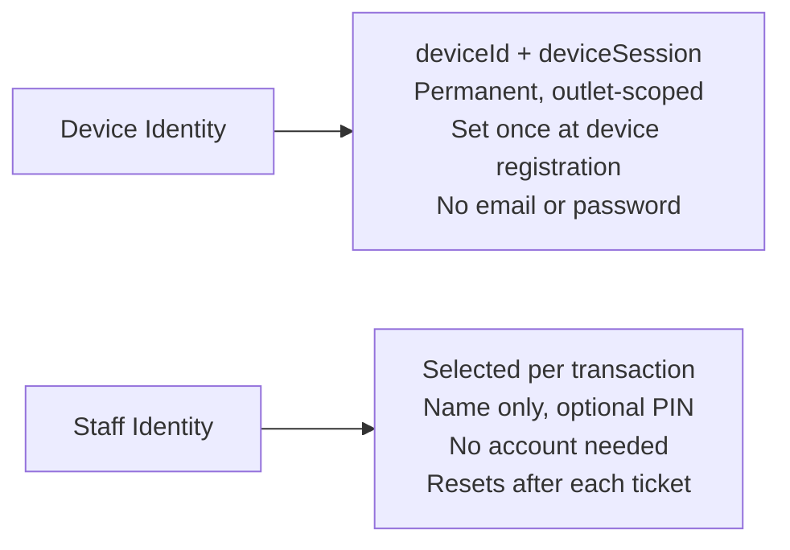
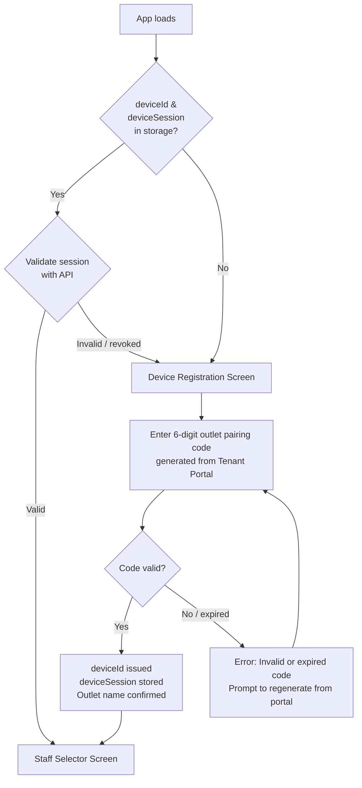

# Feature: Device Registration & Authentication

> **Scope:** Device identity, two-layer authentication model, pairing code registration flow, and session storage.

---

## Authentication Model

The POS portal uses a **two-layer identity model**. Device identity and staff identity are separate concerns handled at different points in the flow.



| Layer | Belongs to | Lifetime | Set by |
| --- | --- | --- | --- |
| `deviceId` | The physical device | Permanent | Outlet manager during setup |
| `deviceSession` | The device–outlet link | Long-lived, revocable | Issued on registration |
| `staffId` | The individual staff member | Per transaction | Staff taps name before each intake |

**Why this model:**

- POS devices belong to outlets, not people — no per-user login needed
- Not all front desk staff have email addresses
- Fast boot is critical for a kiosk environment
- Staff accountability is still maintained through per-ticket attribution
- The outlet manager revokes a device from the tenant portal, not by changing a password

---

## Device Boot Flow

Runs once when the app first loads on a new or unregistered device, and again if the `deviceSession` is missing, expired, or revoked.



### Device Registration Screen

A one-time setup screen. The outlet manager generates a pairing code from the Tenant Portal and hands or displays it to whoever is setting up the POS device.

```
┌──────────────────────────────────────────────────────────┐
│                                                          │
│            [Logo]  RepairFlow POS                        │
│                                                          │
│         ┌────────────────────────────────────┐           │
│         │                                    │           │
│         │   Device Setup                     │           │
│         │                                    │           │
│         │   Enter the 6-digit pairing code   │           │
│         │   from your Tenant Portal.         │           │
│         │                                    │           │
│         │   [ _ _ _ ] – [ _ _ _ ]            │           │
│         │                                    │           │
│         │   Code expires after 10 minutes.   │           │
│         │                                    │           │
│         │   [ Confirm ]                      │           │
│         │                                    │           │
│         └────────────────────────────────────┘           │
│                                                          │
│         Need help? Contact your outlet manager.          │
│                                                          │
└──────────────────────────────────────────────────────────┘
```

| Property | Value |
| --- | --- |
| Pairing code format | 6 digits, split `XXX–XXX` for readability |
| Code lifetime | 10 minutes from generation in Tenant Portal |
| On success | `deviceId` and `deviceSession` stored in `localStorage` |
| On failure | Inline error, prompt to try again or regenerate code |
| Re-registration | Existing session is replaced; previous session invalidated |

### Session Storage

```
localStorage:
  rms_device_id       = "dev_abc123xyz"
  rms_device_session  = "dses_..."
  rms_outlet_name     = "KL Branch"
  rms_outlet_id       = "out_456"
```

> These keys are read on every app load. If either `rms_device_id` or `rms_device_session` is missing, the device registration screen is shown regardless of other stored state.
