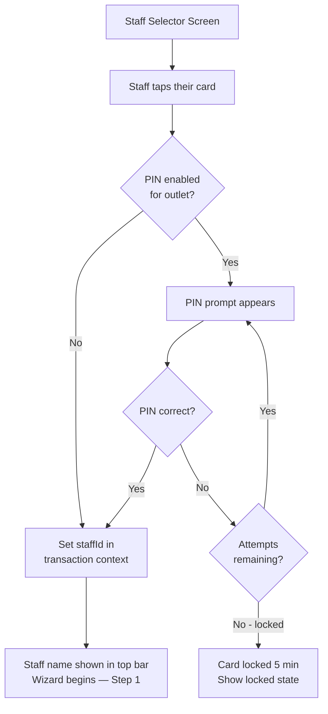

# Feature: Staff Selector & Identity

> **Scope:** Staff selection screen, optional PIN confirmation, staff identity in the top bar, and per-ticket attribution.

---

## Staff Selector Screen

Shown after device session is validated — before every new repair intake. This is where staff identify themselves as the creator of the upcoming ticket. It resets automatically after each completed ticket so the next transaction always starts fresh.

The staff list is fetched from the outlet's staff roster (scoped to the outlet linked to this device). No email, no password — staff members only need to exist in the system.

### Tablet Layout

```
┌───────────────────────────────────────────────────────────────────────┐
│  [Logo]  RepairFlow POS                    [KL Branch]  [MY|EN]  [👤] │
├───────────────────────────────────────────────────────────────────────┤
│                                                                       │
│                      Who's serving?                                   │
│                   Select your name to begin                           │
│                                                                       │
│   ┌─────────────┐  ┌─────────────┐  ┌─────────────┐                   │
│   │     👤      │  │     👤      │  │     👤      │                   │
│   │             │  │             │  │             │                   │
│   │   Ahmad     │  │   Nurul     │  │    Hafiz    │                   │
│   │   Faris     │  │    Ain      │  │    Zain     │                   │
│   └─────────────┘  └─────────────┘  └─────────────┘                   │
│   ┌─────────────┐  ┌─────────────┐                                    │
│   │     👤      │  │     👤      │                                    │
│   │             │  │             │                                    │
│   │    Amir     │  │    Siti     │                                    │
│   │   Hamzah    │  │  Norsiah    │                                    │
│   └─────────────┘  └─────────────┘                                    │
│                                                                       │
└───────────────────────────────────────────────────────────────────────┘
```

### Smartphone Layout

```
┌─────────────────────────────────┐
│  [Logo]  POS        [KL Branch] │
├─────────────────────────────────┤
│                                 │
│       Who's serving?            │
│   Select your name to begin     │
│                                 │
│  ┌──────────┐  ┌──────────┐     │
│  │    👤    │  │    👤    │     │
│  │  Ahmad   │  │  Nurul   │     │
│  │  Faris   │  │   Ain    │     │
│  └──────────┘  └──────────┘     │
│  ┌──────────┐  ┌──────────┐     │
│  │    👤    │  │    👤    │     │
│  │  Hafiz   │  │   Amir   │     │
│  │   Zain   │  │  Hamzah  │     │
│  └──────────┘  └──────────┘     │
│  ┌──────────┐                   │
│  │    👤    │                   │
│  │   Siti   │                   │
│  │ Norsiah  │                   │
│  └──────────┘                   │
│                                 │
└─────────────────────────────────┘
```

---

## Optional PIN Confirmation

If the outlet has PIN verification enabled (configured in Tenant Portal), tapping a staff card triggers a PIN prompt before the wizard begins.

```
┌─────────────────────────────────────────────┐
│                                             │
│   👤  Ahmad Faris                           │
│   Enter your PIN                            │
│                                             │
│        [ ● ] [ ● ] [   ] [   ]              │  ← masked dots
│                                             │
│   [ 1 ]  [ 2 ]  [ 3 ]                       │
│   [ 4 ]  [ 5 ]  [ 6 ]                       │
│   [ 7 ]  [ 8 ]  [ 9 ]                       │
│   [ ← ]  [ 0 ]  [ ✕ ]                       │
│                                             │
└─────────────────────────────────────────────┘
```

| Property | Value |
| --- | --- |
| PIN length | 4 digits |
| Wrong PIN | Shake animation, counter shown (e.g. "2 attempts remaining") |
| Locked out | After 5 wrong attempts, card is locked for 5 minutes |
| PIN optional | Outlet manager enables/disables per outlet in Tenant Portal |

### Staff Selector Flow



---

## Staff Identity in Top Bar

Once a staff member is selected, their name appears in the top bar for the full duration of the transaction. Tapping their name shows a quick-switch option.

```
┌─────────────────────────────────────────────────────────────────────────┐
│  [Logo]  RepairFlow POS         [KL Branch]  [MY|EN]  [👤] Ahmad Faris  │
└─────────────────────────────────────────────────────────────────────────┘
```

Tapping `👤 Ahmad Faris` opens a small popover:

```
  ┌─────────────────────────┐
  │  👤  Ahmad Faris        │
  │  KL Branch              │
  │  ─────────────────────  │
  │  Switch staff member    │  ← returns to staff selector, wizard state preserved
  │  Cancel intake          │  ← triggers discard confirmation dialog
  └─────────────────────────┘
```

> **Note:** Switching staff mid-intake preserves all wizard state. Only the `created_by` field on the ticket is updated to the newly selected staff member.

---

## Ticket Attribution

| Field | Value | Source |
| --- | --- | --- |
| `created_by` | Staff selected on selector screen | Staff Selector |
| `assigned_technician` | Technician chosen in Step 5 | Step 5 |
| `device_id` | Device identifier | `localStorage` |
| `outlet_id` | Outlet linked to device | `localStorage` |

These are distinct — the front desk staff who created the ticket and the technician assigned to repair it can be, and often are, different people.
