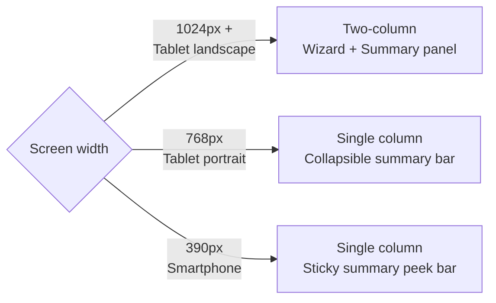

# Feature: Application Shell & Layout

> **Scope:** Application shell, top bar, avatar popover, language toggle, and responsive layout strategy across tablet and smartphone.

---

## Application Shell

### Tablet Layout

```
┌────────────────────────────────────────────────────────────────────────────────────────────────┐
│  [Logo]   ✓ > ✓ > ✓ > 3 issues > 2 parts > Customer & Tech > Summary  [KL Branch] [MY|EN] [👤] │
├────────────────────────────────────────────────────────────────────────────────────────────────┤
│                                                                                                │
│                                     [ Wizard Content ]                                         │
│                                                                                                │
├────────────────────────────────────────────────────────────────────────────────────────────────┤
│  [ ◀  Previous ]                                                             [ Continue  ▶ ]   │
└────────────────────────────────────────────────────────────────────────────────────────────────┘
```

### Smartphone Layout

Breadcrumb drops to a dedicated scrollable second row below the top bar.

```
┌──────────────────────────────────────────────────────────┐
│  [Logo]                            [KL Branch] [EN] [👤] │
├──────────────────────────────────────────────────────────┤
│  ← ✓ > ✓ > ✓ > 3 issues > 2 parts > Customer ... →       │  ← scrollable row
├──────────────────────────────────────────────────────────┤
│                                                          │
│                    [ Wizard Content ]                    │
│                                                          │
├──────────────────────────────────────────────────────────┤
│  [ ◀  Previous ]                        [ Continue  ▶ ]  │
├──────────────────────────────────────────────────────────┤
│  RM 561.00  ·  Step 4 of 6                             ▲ │
└──────────────────────────────────────────────────────────┘
```

### Top Bar Elements

| Element | Description |
| --- | --- |
| Logo | Tapping does nothing — POS is a locked interface |
| Breadcrumb | Dynamic, centred (tablet) / scrollable second row (mobile). See Breadcrumb section |
| Outlet badge | Current outlet name in a pill/badge. Read-only |
| Language toggle | `MY \| EN` — switches UI language. Persisted to localStorage |
| Avatar icon | Tappable — opens staff popover dropdown |

---

## Avatar Popover

```
                                              ┌─────────────────────────┐
                                              │  👤  Ahmad Faris        │
                                              │  KL Branch              │
                                              │  ─────────────────────  │
                                              │  Switch staff member    │
                                              │  Cancel intake          │
                                              └─────────────────────────┘
                                                                      [👤]
```

| Action | Behaviour |
| --- | --- |
| Switch staff member | Returns to Staff Selector screen; wizard state fully preserved |
| Cancel intake | Triggers discard confirmation dialog |

---

## Language Toggle

Two-option toggle. Switches all UI labels, placeholders, and system text instantly. Staff-selected language is stored in `localStorage` and persists across sessions.

```
[ MY | EN ]   ←  active option is highlighted
```

| Code | Language |
| --- | --- |
| `MY` | Bahasa Malaysia |
| `EN` | English |

The only intentional exit points from the POS portal are:

- **Successful job creation** → redirects to the Job Confirmation screen
- **Session timeout** → redirects to the Staff Selector screen
- **Cancel Intake** via avatar popover → triggers a discard confirmation dialog

---

## Responsive Layout Strategy

The layout adapts across three breakpoints based on the primary and secondary devices.



### Tablet Landscape — 1024px+ (Primary)

Two-column layout. Wizard content on the left, persistent summary panel on the right. Breadcrumb centred in the top bar.

```
┌─────────────────────────────────────────────────────────────────────────────────────────────┐
│  [Logo]   ✓ > ✓ > 3 issues > 2 parts > Customer & Tech > Summary   [KL Branch] [MY|EN] [👤] │
├─────────────────────────────────────────────────────────────────────────────────────────────┤
│                                              │                                              │
│       Wizard Content                         │     Persistent Summary Panel                 │
│       (fills left area)                      │     (fixed right, scrollable)                │
│                                              │                                              │
├─────────────────────────────────────────────────────────────────────────────────────────────┤
│  [ ◀  Previous ]                                                           [ Continue  ▶ ]  │
└─────────────────────────────────────────────────────────────────────────────────────────────┘
```

### Tablet Portrait — 768px (Secondary)

Breadcrumb stays in the top bar but may truncate. Summary collapses to a tappable bar.

```
┌───────────────────────────────────────────────────────────┐
│  [Logo]  ✓ > ✓ > 3 issues > 2 parts > ...  [KL] [EN] [👤] │
├───────────────────────────────────────────────────────────┤
│  📱 iPhone 16 Pro Max  ·  RM 561.00  ·  4 of 6         ▾  │  ← Collapsed summary bar
├───────────────────────────────────────────────────────────┤
│                                                           │
│              Wizard Content (full width)                  │
│                                                           │
├───────────────────────────────────────────────────────────┤
│  [ ◀  Previous ]                         [ Continue  ▶ ]  │
└───────────────────────────────────────────────────────────┘
```

### Smartphone — 390px (On-the-go POS)

Top bar shows logo and right-side icons only. Breadcrumb drops to a dedicated horizontally scrollable second row.

```
┌────────────────────────────────────────────────────────────┐
│  [Logo]                              [KL Branch] [EN] [👤] │
├────────────────────────────────────────────────────────────┤
│  ← ✓ > ✓ > 3 issues > 2 parts > Customer & Tech > ... →.   │  ← scrollable breadcrumb row
├────────────────────────────────────────────────────────────┤
│                                                            │
│         Wizard Content (full width, scrollable)            │
│                                                            │
├────────────────────────────────────────────────────────────┤
│  [ ◀  Previous ]                          [ Continue  ▶ ]  │
├────────────────────────────────────────────────────────────┤
│  RM 561.00  ·  Step 4 of 6                             ▲   │  ← Sticky summary peek bar
└────────────────────────────────────────────────────────────┘
```
