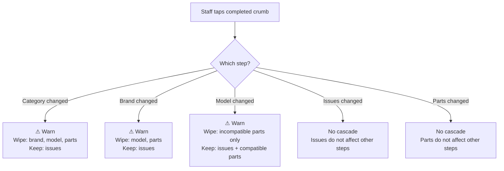
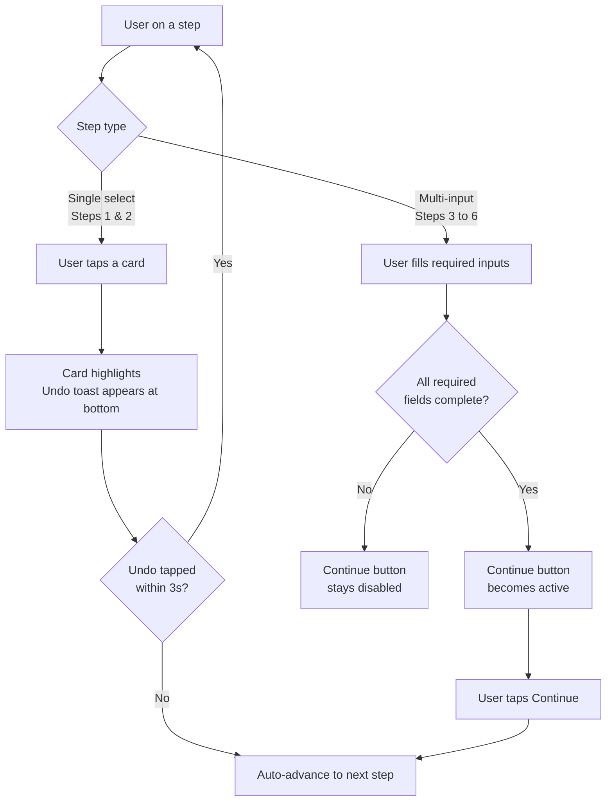

# Feature: Navigation, Breadcrumb & Summary

> **Scope:** Dynamic breadcrumb, navigation patterns (auto-advance vs sticky action bar), cascade warning rules, reselection behaviour, and the persistent summary panel.

---

## Dynamic Breadcrumb

Replaces the static step progress indicator entirely. Lives in the top bar on tablet and in a dedicated scrollable second row on smartphone. Tapping a completed crumb navigates back to that step.

### Breadcrumb States

| State | Display | Tappable |
| --- | --- | --- |
| Upcoming step — nothing selected | Step label (e.g. `Diagnostic`) | No — muted |
| Current step — active | Step label, highlighted | No |
| Completed, single selection | `✓` icon | Yes — navigates back |
| Completed, multi-selection | Count label (e.g. `3 issues`, `2 parts`) | Yes — navigates back |

### Progression Example

```
Initial (nothing selected):
Category  >  Brand  >  Model  >  Diagnostic  >  Parts  >  Customer & Tech  >  Summary

After Step 1 (Smartphone selected):
✓  >  Brand  >  Model  >  Diagnostic  >  Parts  >  Customer & Tech  >  Summary

After Step 2 (iPhone 13 Pro selected — brand and model both collapse to ✓):
✓  >  ✓  >  Diagnostic  >  Parts  >  Customer & Tech  >  Summary

After Step 3 (3 issues selected):
✓  >  ✓  >  3 issues  >  Parts  >  Customer & Tech  >  Summary

After Step 4 (2 parts added):
✓  >  ✓  >  3 issues  >  2 parts  >  Customer & Tech  >  Summary

After Step 5 (customer and tech assigned):
✓  >  ✓  >  3 issues  >  2 parts  >  ✓  >  Summary
```

> **Why brand and model both collapse to ✓:**
> Brand is a filter, not a final decision — the model tap is the decisive action. Collapsing both keeps the breadcrumb compact.

### Count Label Format

| Step | Label format | Example |
| --- | --- | --- |
| Step 3 — Diagnostics | `{n} issue` / `{n} issues` | `1 issue`, `3 issues` |
| Step 4 — Parts | `{n} part` / `{n} parts` | `1 part`, `2 parts` |

### Tappable Completed Crumb Behaviour

Tapping a completed `✓` or count label navigates back to that step. If downstream steps have data that may be affected, a cascade warning dialog appears first (see Reselection Cascade Rules).

```
✓  >  ✓  >  3 issues  >  2 parts  >  Customer & Tech  >  Summary
↑          ↑           ↑
tappable   tappable    tappable — navigates back to Step 3
```

### Reselection Cascade Rules

When a completed crumb is tapped and the selection is changed, downstream data is evaluated for compatibility and selectively cleared with a warning.



**Cascade warning dialog (example — model change):**

```
┌──────────────────────────────────────────────────┐
│  ⚠  Changing the model may affect your parts     │
│                                                  │
│  Will be removed (incompatible):                 │
│  · iPhone 13 Pro Screen                          │
│                                                  │
│  Will be kept (compatible or universal):         │
│  · USB-C Cable                                   │
│                                                  │
│  [ Cancel ]              [ Continue anyway ]     │
└──────────────────────────────────────────────────┘
```

| Action | Behaviour |
| --- | --- |
| Cancel | Closes dialog; stays on current step; no changes made |
| Continue anyway | Applies cascade; navigates back to the tapped step |

> **Note:** Full compatibility data model (which parts are device-specific vs universal) is a backend concern and out of scope for this spec. The UI spec assumes the API returns a compatibility flag per selected part when a reselection occurs.

---

## Navigation Pattern

Different steps use different navigation patterns based on the nature of their input.



### Auto-Advance (Steps 1 & 2)

Applies to steps where a single decisive tap completes the step entirely.

- Card is tapped → highlights with active state
- A brief undo toast appears at the bottom of the screen for 3 seconds
- After 3 seconds (or if toast is dismissed), the wizard advances automatically
- Tapping **Undo** in the toast snaps back to the current step with selection cleared

```
  [ Smartphone selected                        Undo ]   ← toast, 3s
```

### Sticky Action Bar (Steps 3–6)

Applies to steps with multiple inputs, additive actions, or irreversible submission.

```
Tablet
┌──────────────────────────────────────────────────────────┐
│  [ ◀  Previous ]                        [ Continue  ▶ ]  │
└──────────────────────────────────────────────────────────┘

Smartphone
┌──────────────────────────────────────────────────────────┐
│  [ ◀  Previous ]                        [ Continue  ▶ ]  │
├──────────────────────────────────────────────────────────┤
│  $561.00  ·  Step 4 of 6                              ▲  │
└──────────────────────────────────────────────────────────┘
```

On Step 6, Continue is replaced by the primary submission CTA:

```
┌──────────────────────────────────────────────────────────┐
│  [ ◀  Previous ]               [ ✔  Create Repair Job ]  │
└──────────────────────────────────────────────────────────┘
```

---

## Persistent Summary Panel

Visible on tablet landscape throughout all steps. Progressively fills as the user advances. Collapses to a bar/sheet on tablet portrait and smartphone.

```
┌─────────────────────────┐
│  Repair Summary         │
│  ─────────────────────  │
│  📱 iPhone 16 Pro Max   │  ← populated from Step 2
│  Smartphone             │  ← populated from Step 1
│                         │
│  Issues                 │  ← populated from Step 3
│  · Display/Screen       │
│  · Battery              │
│                         │
│  Parts                  │  ← populated from Step 4
│  · Screen      $320     │
│  · Battery      $85     │
│                         │
│  Tech     Hafiz Zain    │  ← populated from Step 5
│  Customer  Ali Evans    │  ← populated from Step 5
│                         │
│  ─────────────────────  │
│  Est. Total   $561.00   │  ← updates live from Step 4
└─────────────────────────┘
```

| State | Display |
| --- | --- |
| Field not yet reached | `—` placeholder |
| Field in progress | Live update as user interacts |
| Field completed | Populated value, muted style |
| Running total | Always shows current parts subtotal + est. labour |
