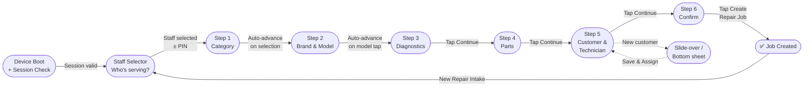

# Feature: Step 1 — Device Category

> **Scope:** Wizard Step 1. Device category selection via tappable icon cards with auto-advance and inspection fee notice.

---

## Prerequisites

This step runs inside the [App Shell](pos-03-app-shell.md) and uses the [Navigation & Breadcrumb](pos-04-navigation.md) system. See [Wizard State Management](pos-14-state-errors-accessibility.md) for data model definitions.

---

## UI Layout

**Navigation:** Auto-advance on card tap

```
┌──────────────────────────────────────────────────────────────────────────────────────────────────────────────┐
│  [Logo]  Category > Brand > Model > Diagnostic > Parts > Customer & Tech > Summary  [KL Branch] [MY|EN] [👤] │
├────────────────────────────────────────────────────────────────────────────────┬─────────────────────────────┤
│                                                                                │  Repair Summary             │
│                             New Repair Intake                                  │  ─────────────────────────  │
│                      Select the device type to get started                     │  Parts                   —  │
│                                                                                │  Tech                    —  │
│                   ┌───────────┐  ┌───────────┐  ┌───────────┐                  │  Customer                —  │
│                   │   [icon]  │  │   [icon]  │  │   [icon]  │                  │  ─────────────────────────  │
│                   │Smartphone │  │  Laptop   │  │  Tablet   │                  │  Est. Total              —  │
│                   └───────────┘  └───────────┘  └───────────┘                  │                             │
│                   ┌───────────┐  ┌───────────┐  ┌───────────┐                  │                             │
│                   │   [icon]  │  │   [icon]  │  │   [icon]  │                  │                             │
│                   │ Wearable  │  │  Console  │  │   Other   │                  │                             │
│                   └───────────┘  └───────────┘  └───────────┘                  │                             │
│                                                                                │                             │
│                 ┌──────────────────────────────────────────────┐               │                             │
│                 │ ⚠  Standard Inspection Fee applies to all    │               │                             │
│                 │    new intakes. Reflected in final estimate. │               │                             │
│                 └──────────────────────────────────────────────┘               │                             │
│                                                                                │                             │
│  [✕ Cancel Intake]                                                             │                             │
└────────────────────────────────────────────────────────────────────────────────┴─────────────────────────────┘
```

---

## UI Components

| Component | Description |
| --- | --- |
| Category grid | 6 tappable icon cards in a 3×2 layout; min 80px height per card |
| Card states | Default / Pressed / Selected (highlighted border + tint) |
| Inspection Fee banner | Dismissible info banner |
| Cancel Intake | Ghost button, always visible, triggers discard confirmation dialog |

---

## Behaviour

- Single selection only; tapping another card deselects the previous
- On tap → card highlights → undo toast → auto-advance after 3s
- No Continue button on this step

---

## Wizard Context


