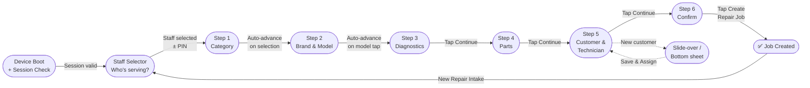

# Feature: Step 2 — Brand & Model

> **Scope:** Wizard Step 2. Brand selector, model grid, search with auto-advance, and manual entry fallback.

---

## Prerequisites

This step runs inside the [App Shell](pos-03-app-shell.md) and uses the [Navigation & Breadcrumb](pos-04-navigation.md) system. See [Wizard State Management](pos-14-state-errors-accessibility.md) for data model definitions.

---

## UI Layout

**Navigation:** Auto-advance on model card tap

### Initial State — Brand Row Visible

```
┌───────────────────────────────────────────────────────────────────────────────────────────────────────┐
│  [Logo]  ✓ > Brand & Model > Diagnostic > Parts > Customer & Tech > Summary  [KL Branch] [MY|EN] [👤] │
├───────────────────────────────────────────────────────────────────────────┬───────────────────────────┤
│                                                                           │  Repair Summary           │
│                  Identify the Device                                      │  ─────────────────────    │
│                                                                           │  📱 —                     │
│                  [ 🔍  Search brand, model or part number...   ]          │  Smartphone               │
│                                                                           │  Issues        —          │
│                  Select Brand                                             │  Parts         —          │
│                  ┌──────┐ ┌──────┐ ┌──────┐ ┌──────┐ ┌──────┐             │  Tech          —          │
│                  │APPLE │ │SAMSG │ │GOOGL │ │HUAWEI│ │  +   │             │  Customer      —          │
│                  └──────┘ └──────┘ └──────┘ └──────┘ └──────┘             │  ─────────────────────    │
│                                               ← scrollable →              │  Est. Total    —          │
│                                                                           │                           │
│  [✕ Cancel Intake]                                                        │                           │
└───────────────────────────────────────────────────────────────────────────┴───────────────────────────┘
```

### After Brand Tapped — Brand Row Collapses, Model Grid Expands

```
┌──────────────────────────────────────────────────────────────────────────────────┐
│  [Logo]  ✓ > Brand & Model > Diagnostic > Parts > Customer & Tech > Summary  [KL Branch] [MY|EN] [👤] │
├─────────────────────────────────────────────────────┬───────────────────────────┤
│                                                      │  Repair Summary           │
│  Identify the Device                                 │  ─────────────────────    │
│                                                      │  📱 —                     │
│  [ 🔍  Search brand, model or part number...   ]    │  Smartphone               │
│                                                      │                           │
│  [ 🍎 Apple  × ]  Change brand                      │                           │  ← collapsed badge
│  ─────────────────────────────────────────────────  │                           │
│  ┌──────────┐ ┌──────────┐ ┌──────────┐ ┌────────┐ │                           │
│  │ [image]  │ │ [image]  │ │ [image]  │ │[image] │ │                           │
│  │iPhone 16 │ │iPhone 16 │ │iPhone 15 │ │iPhone  │ │                           │
│  │ Pro Max  │ │   Pro    │ │ Pro Max  │ │   14   │ │                           │
│  └──────────┘ └──────────┘ └──────────┘ └────────┘ │                           │
│  ┌──────────┐ ┌──────────┐ ┌──────────┐ ┌────────┐ │                           │
│  │ [image]  │ │ [image]  │ │ [image]  │ │[image] │ │                           │
│  │iPhone 13 │ │iPhone 13 │ │  iPad    │ │MacBook │ │                           │
│  │  Pro Max │ │   Pro    │ │   Pro    │ │  Pro   │ │                           │
│  └──────────┘ └──────────┘ └──────────┘ └────────┘ │                           │
│                               ← scrollable grid →   │                           │
│                                                      │                           │
│  ┌────────────────────────────────────┐             │                           │
│  │  Can't find it? Enter manually →  │             │                           │
│  └────────────────────────────────────┘             │                           │
│                                                      │                           │
│  [✕ Cancel Intake]                                  │                           │
└─────────────────────────────────────────────────────┴───────────────────────────┘
```

### After Model Tapped — Breadcrumb Updates, Auto-Advance Begins

```
[Logo]  ✓ > iPhone 16 Pro Max > Diagnostic > Parts > Customer & Tech > Summary  ...
```

---

## UI Components

| Component | Description |
| --- | --- |
| Search bar | Full-text search across all brands and models; always visible |
| Brand selector | Horizontally scrollable row; collapses to badge on brand tap |
| Brand badge | `[ 🏷 BrandName × ]  Change brand` — tapping × or Change re-expands row, clears model |
| Model grid | Expands to fill full width after brand collapses; scrollable |
| Model card | Device image, name, variant tag; min 100px height for touch |
| "Can't find it?" | Inline text input for manual device name; appears below model grid |

---

## Behaviour

- Brand tap → brand row animates out → brand badge appears → model grid expands
- Tapping `×` on brand badge or "Change brand" → model grid hides → brand row re-expands → model selection cleared
- Search bar overrides the brand/model flow entirely — results shown as a flat list
- Model tap → highlights briefly → undo toast → auto-advance after 3s
- Breadcrumb updates from `Brand & Model` to the selected model name on tap
- Manual entry confirms as a model selection and triggers auto-advance

---

## Wizard Context


