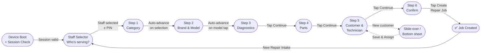

# Feature: Step 3 — Device Diagnostics

> **Scope:** Wizard Step 3. Multi-select issue cards, specific notes textarea, and device context badge.

---

## Prerequisites

This step runs inside the [App Shell](pos-03-app-shell.md) and uses the [Navigation & Breadcrumb](pos-04-navigation.md) system. See [Wizard State Management](pos-14-state-errors-accessibility.md) for data model definitions.

---

## UI Layout

**Navigation:** Sticky action bar (multi-select, no clear "done" signal)

```
┌──────────────────────────────────────────────────────────────────────────────────┐
│  [Logo]  ✓ > iPhone 16 Pro Max > Diagnostic > Parts > Customer & Tech > Summary  [KL Branch] [MY|EN] [👤] │
├─────────────────────────────────────────────────────┬───────────────────────────┤
│                                                      │  Repair Summary           │
│  Device Diagnostics                                  │  ─────────────────────    │
│                                                      │                           │
│  ┌──────────────────────────────────────────────┐   │  Issues                   │
│  │ ℹ  Inspect device with the customer present. │   │  · Display/Screen ←live   │
│  │    Select all visible and reported issues.   │   │  · Battery        ←live   │
│  └──────────────────────────────────────────────┘   │                           │
│                                                      │  Parts         —          │
│  Customer Issues      [ iPhone 16 Pro Max  × ]      │  Tech          —          │
│                                                      │  Customer      —          │
│  ┌─────────┐ ┌─────────┐ ┌─────────┐ ┌─────────┐  │  ─────────────────────    │
│  │ [icon]  │ │ [icon]  │ │ [icon]  │ │ [icon]  │  │  Est. Total    —          │
│  │ Display │ │ Battery │ │Charging │ │  Audio  │  │                           │
│  │ ✓ active│ │ ✓ active│ │  Port   │ │         │  │                           │
│  └─────────┘ └─────────┘ └─────────┘ └─────────┘  │                           │
│  ┌─────────┐ ┌─────────┐ ┌─────────┐ ┌─────────┐  │                           │
│  │ [icon]  │ │ [icon]  │ │ [icon]  │ │ [icon]  │  │                           │
│  │ Camera  │ │ Network │ │  Water  │ │  Other  │  │                           │
│  │         │ │         │ │ Damage  │ │         │  │                           │
│  └─────────┘ └─────────┘ └─────────┘ └─────────┘  │                           │
│                                                      │                           │
│  Other Issue / Specific Notes                        │                           │
│  ┌──────────────────────────────────────────────┐   │                           │
│  │  Describe additional issues here...          │   │                           │
│  └──────────────────────────────────────────────┘   │                           │
│                                                      │                           │
│  [✕ Cancel]                                         │                           │
├─────────────────────────────────────────────────────┴───────────────────────────┤
│  [ ◀  Previous ]                                        [ Continue  ▶ ]         │
└──────────────────────────────────────────────────────────────────────────────────┘
```

---

## UI Components

| Component | Description |
| --- | --- |
| Diagnostics Note | Dismissible info banner |
| Issues grid | Multi-select tappable cards; min 72px height; active state on select |
| Device context badge | Shows model from Step 2; tapping × returns to Step 2 |
| Specific Notes | Freetext textarea for details beyond the shortcut cards |

---

## Behaviour

- Multiple issue cards can be selected simultaneously
- Summary panel issues list updates live with each tap
- At least one card **or** a non-empty notes field required to enable Continue

---

## Wizard Context


