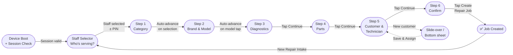

# Feature: Step 4 — Parts Selection

> **Scope:** Wizard Step 4. Parts search, inventory list with stock status, quantity steppers, and live subtotal updates.

---

## Prerequisites

This step runs inside the [App Shell](pos-03-app-shell.md) and uses the [Navigation & Breadcrumb](pos-04-navigation.md) system. See [Wizard State Management](pos-14-state-errors-accessibility.md) for data model definitions.

---

## UI Layout

**Navigation:** Sticky action bar (additive, user decides when list is complete)

```
┌──────────────────────────────────────────────────────────────────────────────────┐
│  [Logo]  ✓ > ✓ > 3 issues > Parts > Customer & Tech > Summary  [KL Branch] [MY|EN] [👤] │
├─────────────────────────────────────────────────────┬─────────────────────────────┤
│                                                      │  Repair Summary             │
│  Select Parts                                        │  ─────────────────────────  │
│                                                      │                           │
│                                                      │  📱 iPhone 16 Pro Max       │
│  [ 🔍  Search parts or SKU...                  ]    │                         │
│                                                      │  Issues                 │
│  ┌────────────────────────────────────────────────┐  │  · Display/Screen       │
│  │ iPhone 16 Pro Screen    Compatible  $320  [+]  │  │  · Battery              │
│  │ Stock: 4                                       │  │                         │
│  ├────────────────────────────────────────────────┤  │  Parts                  │
│  │ iPhone 16 Battery       Compatible   $85  [+]  │  │  · Screen  1×  $320 ←  │
│  │ Stock: 7                                       │  │  · Battery 1×   $85 ←  │
│  ├────────────────────────────────────────────────┤  │                         │
│  │ USB-C Port Module       Generic      $45  [+]  │  │  Tech          —        │
│  │ Stock: 2                                       │  │  Customer      —        │
│  └────────────────────────────────────────────────┘  │  ─────────────────────  │
│                                                      │  Est. Total  $561.00 ← │
│  Selected Parts                                      │                         │
│  ┌────────────────────────────────────────────────┐  │                         │
│  │ iPhone 16 Pro Screen       [ - ]  1  [ + ]     │  │                         │
│  │                                        $320.00 │  │                         │
│  ├────────────────────────────────────────────────┤  │                         │
│  │ iPhone 16 Battery          [ - ]  1  [ + ]     │  │                         │
│  │                                         $85.00 │  │                         │
│  ├────────────────────────────────────────────────┤  │                         │
│  │ Subtotal                               $405.00 │  │                         │
│  └────────────────────────────────────────────────┘  │                         │
│                                                      │                         │
│  [✕ Cancel]                                         │                         │
├─────────────────────────────────────────────────────┴─────────────────────────┤
│  [ ◀  Previous ]                                        [ Continue  ▶ ]       │
└──────────────────────────────────────────────────────────────────────────────┘
```

---

## UI Components

| Component | Description |
| --- | --- |
| Search bar | Real-time parts lookup by name or SKU |
| Results list | Part name, compatibility tag, stock count, unit price, large [+] Add button |
| Selected Parts | List of added parts with [−] qty [+] stepper controls and line totals |
| Subtotal | Updates live as parts are added, removed, or quantities adjusted |

---

## Behaviour

- Search filters inventory in real time
- Out-of-stock parts: [+] button disabled, "Out of Stock" label shown
- Adding a part performs optimistic stock count decrement in the UI
- Summary panel parts list and running total update live
- At least one part required to enable Continue

---

## Wizard Context


