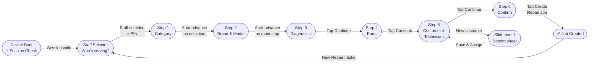

# Feature: Step 5 — Customer & Technician

> **Scope:** Wizard Step 5. Customer search with collapse-to-badge pattern, technician inline list with availability, and new customer trigger.

---

## Prerequisites

This step runs inside the [App Shell](pos-03-app-shell.md) and uses the [Navigation & Breadcrumb](pos-04-navigation.md) system. See [Wizard State Management](pos-14-state-errors-accessibility.md) for data model definitions.

---

## UI Layout

**Navigation:** Sticky action bar — Continue activates once both customer and technician are selected (both collapsed to badges).

Uses the same **select → collapse → next reveals** pattern as Step 2. Customer is resolved first; once collapsed, the technician list expands to fill the space.

---

### State 1 — Initial (nothing selected)

```
┌──────────────────────────────────────────────────────────────────────────────────┐
│  [Logo]  ✓ > iPhone 16 Pro Max > 3 issues > 2 parts > Customer & Tech > Summary  [KL Branch] [MY|EN] [👤] │
├─────────────────────────────────────────────────────┬───────────────────────────┤
│                                                      │  Repair Summary           │
│  Customer & Technician                               │  ─────────────────────    │
│                                                      │  📱 iPhone 16 Pro Max     │
│  Find Customer                                       │                           │
│  [ 🔍  Search name, phone, or email...         ]    │  Issues                   │
│                                                      │  · Display/Screen         │
│  ┌──────────────────────────────────────────────┐   │  · Battery                │
│  │  👤  Ali Evans                               │   │                           │
│  │      +601X-XXX XXXX  ·  3 previous repairs  │   │  Parts                    │
│  └──────────────────────────────────────────────┘   │  · Screen      $320       │
│  ┌──────────────────────────────────────────────┐   │  · Battery      $85       │
│  │  👤  Alice Tan                               │   │                           │
│  │      +601X-XXX XXXX  ·  1 previous repair   │   │  Tech          —          │
│  └──────────────────────────────────────────────┘   │  Customer      —          │
│                                                      │  ─────────────────────    │
│  [ + Create New Customer ]                          │  Est. Total  $561.00      │
│                                                      │                           │
│  ┌──────────────────────────────────────────────┐   │                           │
│  │ 🔵  Unlock Loyalty Insights with Service     │   │                           │
│  │     History — link a profile to view         │   │                           │
│  │     repair history & loyalty data.           │   │                           │
│  └──────────────────────────────────────────────┘   │                           │
│                                                      │                           │
│  Assign Technician                                   │                           │
│  (visible but muted — awaiting customer selection)   │                           │
│                                                      │                           │
│  [✕ Cancel]                                         │                           │
├─────────────────────────────────────────────────────┴───────────────────────────┤
│  [ ◀  Previous ]                                   [ Continue  ▶ ] (disabled)   │
└──────────────────────────────────────────────────────────────────────────────────┘
```

---

### State 2 — Customer selected, technician list expands

Customer search collapses to a badge. Technician list expands inline to fill the freed space.

```
┌──────────────────────────────────────────────────────────────────────────────────┐
│  [Logo]  ✓ > iPhone 16 Pro Max > 3 issues > 2 parts > Customer & Tech > Summary  [KL Branch] [MY|EN] [👤] │
├─────────────────────────────────────────────────────┬───────────────────────────┤
│                                                      │  Repair Summary           │
│  Customer & Technician                               │  ─────────────────────    │
│                                                      │  📱 iPhone 16 Pro Max     │
│  [ 👤 Ali Evans · +601X-XXX  ×  Change ]            │                           │  ← collapsed badge
│  ──────────────────────────────────────────────────  │  Issues                   │
│                                                      │  · Display/Screen         │
│  Assign Technician                                   │  · Battery                │
│  ┌──────────────────────────────────────────────┐   │                           │
│  │  👤  Ahmad Faris                             │   │  Parts                    │
│  │      Senior Tech  ·  2 active jobs   🟡 Busy │   │  · Screen      $320       │
│  ├──────────────────────────────────────────────┤   │  · Battery      $85       │
│  │  👤  Nurul Ain                               │   │                           │
│  │      Junior Tech  ·  1 active job    🟡 Busy │   │  Tech          —          │
│  ├──────────────────────────────────────────────┤   │  Customer  Ali Evans ←    │
│  │  👤  Hafiz Zain                              │   │  ─────────────────────    │
│  │      Senior Tech  ·  0 jobs      🟢 Available│   │  Est. Total  $561.00      │
│  └──────────────────────────────────────────────┘   │                           │
│              ← scrollable list →                    │                           │
│                                                      │                           │
│  [✕ Cancel]                                         │                           │
├─────────────────────────────────────────────────────┴───────────────────────────┤
│  [ ◀  Previous ]                                   [ Continue  ▶ ] (disabled)   │
└──────────────────────────────────────────────────────────────────────────────────┘
```

---

### State 3 — Both selected, Continue activates

Technician collapses to a badge. Continue becomes active immediately.

```
┌──────────────────────────────────────────────────────────────────────────────────┐
│  [Logo]  ✓ > iPhone 16 Pro Max > 3 issues > 2 parts > ✓ > Summary  [KL Branch] [MY|EN] [👤] │
├─────────────────────────────────────────────────────┬───────────────────────────┤
│                                                      │  Repair Summary           │
│  Customer & Technician                               │  ─────────────────────    │
│                                                      │  📱 iPhone 16 Pro Max     │
│  [ 👤 Ali Evans · +601X-XXX  ×  Change ]            │                           │
│  [ 👤 Hafiz Zain · Senior Tech  ×  Change ]         │  Issues                   │
│                                                      │  · Display/Screen         │
│  ┌──────────────────────────────────────────────┐   │  · Battery                │
│  │ 🔵  Unlock Loyalty Insights with Service     │   │                           │
│  │     History — link a profile to view         │   │  Parts                    │
│  │     repair history & loyalty data.           │   │  · Screen      $320       │
│  └──────────────────────────────────────────────┘   │  · Battery      $85       │
│                                                      │                           │
│  [✕ Cancel]                                         │  Tech    Hafiz Zain ←     │
│                                                      │  Customer  Ali Evans      │
│                                                      │  ─────────────────────    │
│                                                      │  Est. Total  $561.00      │
├─────────────────────────────────────────────────────┴───────────────────────────┤
│  [ ◀  Previous ]                                    [ Continue  ▶ ] (active)    │
└──────────────────────────────────────────────────────────────────────────────────┘
```

---

### Smartphone — Technician as scrollable inline list

Same collapse pattern. Technician list is a vertically scrollable inline list, not a dropdown. Customer and tech badges stack vertically when both selected.

```
┌─────────────────────────────────────────────────────────┐
│  [Logo]                              [KL Branch] [EN] [👤] │
├─────────────────────────────────────────────────────────┤
│  ← ✓ > iPhone 16 Pro Max > 3 issues > 2 parts > ... →  │
├─────────────────────────────────────────────────────────┤
│                                                          │
│  [ 👤 Ali Evans · +601X-XXX  ×  Change ]                │  ← customer badge
│  ────────────────────────────────────────────────────    │
│                                                          │
│  Assign Technician                                       │
│  ┌──────────────────────────────────────────────────┐   │
│  │  👤  Ahmad Faris  Senior · 2 jobs  🟡            │   │
│  ├──────────────────────────────────────────────────┤   │
│  │  👤  Nurul Ain    Junior · 1 job   🟡            │   │
│  ├──────────────────────────────────────────────────┤   │
│  │  👤  Hafiz Zain   Senior · 0 jobs  🟢  ✓ selected│   │
│  └──────────────────────────────────────────────────┘   │
│                  ← scrollable →                          │
│                                                          │
├──────────────────────────────────────────────────────────┤
│  [ ◀  Previous ]              [ Continue  ▶ ]           │
├──────────────────────────────────────────────────────────┤
│  RM 561.00  ·  Step 5 of 6                         ▲   │
└──────────────────────────────────────────────────────────┘
```

---

## UI Components

| Component | Description |
| --- | --- |
| Customer search | Debounced 300ms lookup; visible only before customer is selected |
| Customer badge | `[ 👤 Name · Phone  ×  Change ]` — tapping × or Change re-expands search |
| Create New | Visible below search; triggers slide-over (tablet) or bottom sheet (mobile) |
| Upsell banner | Dismissible; shown in State 3 when space is available |
| Technician list | Inline scrollable list — tablet and mobile; no dropdown |
| Technician badge | `[ 👤 Name · Role  ×  Change ]` — tapping re-expands list |
| Availability badge | 🟢 Available / 🟡 Busy / 🔴 Unavailable per technician row |

---

## Behaviour

- Customer must be selected before technician list becomes interactive
- Technician list is muted/disabled in State 1; activates after customer collapses
- Tapping `×` or `Change` on either badge re-expands that section; the other stays collapsed
- If customer is changed, technician selection is preserved (no cascade between these two)
- Both badges must be present for Continue to activate
- Summary panel updates customer and tech fields live as each is selected

---

## Wizard Context


