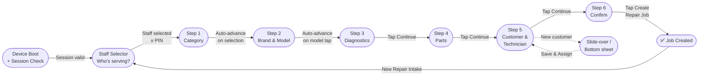

# Feature: Step 6 — Confirm & Create

> **Scope:** Wizard Step 6. Final invoice review, read-only summary, Create Repair Job CTA with duplicate prevention.

---

## Prerequisites

This step runs inside the [App Shell](pos-03-app-shell.md) and uses the [Navigation & Breadcrumb](pos-04-navigation.md) system. See [Wizard State Management](pos-14-state-errors-accessibility.md) for data model definitions.

---

## UI Layout

**Navigation:** Sticky action bar with Create Repair Job CTA

The summary panel has already shown all information progressively. Step 6 serves as the **full invoice view and point of no return** — staff turns the screen to the customer for sign-off before tapping Create.

```
┌──────────────────────────────────────────────────────────────────────────────────┐
│  [Logo]  ✓ > ✓ > 3 issues > 2 parts > ✓ > Summary  [KL Branch] [MY|EN] [👤]   │
├─────────────────────────────────────────────────────┬─────────────────────────────┤
│                                                      │  Repair Summary             │
│  Final Invoice                                       │  ─────────────────────────  │
│                                                      │                         │
│  ┌────────────────────────────────────────────────┐  │  Issues                 │
│  │ iPhone 16 Pro Screen       1×      RM 320.00   │  │  · Display/Screen       │
│  │ iPhone 16 Battery          1×       RM  85.00  │  │  · Battery              │
│  │ Labour Fee                          RM  80.00  │  │                         │
│  │ ──────────────────────────────────────────     │  │  Parts                  │
│  │ Subtotal                           RM 485.00   │  │  · Screen      $320     │
│  │ Tax (6% SST)                        RM  29.10  │  │  · Battery      $85     │
│  │ ──────────────────────────────────────────     │  │                         │
│  │ Grand Total                        RM 514.10   │  │  Tech     Hafiz Zain    │
│  └────────────────────────────────────────────────┘  │  Customer  Ali Evans    │
│                                                      │  ─────────────────────  │
│  [✕ Cancel]                                         │  Est. Total  RM 514.10  │
├─────────────────────────────────────────────────────┴─────────────────────────┤
│  [ ◀  Previous ]                         [ ✔  Create Repair Job ]             │
└──────────────────────────────────────────────────────────────────────────────┘
```

---

## UI Components

| Component | Description |
| --- | --- |
| Invoice table | Line items, labour, subtotal, tax, grand total |
| Create Repair Job | Primary CTA — full-width on mobile, right-aligned on tablet |

---

## Behaviour

- All content is read-only; editing requires navigating back
- **Create Repair Job** is disabled after first tap to prevent duplicate submission
- On success → navigate to Job Confirmation screen, show success toast
- On failure → inline error message displayed; wizard state fully preserved

---

## Wizard Context


