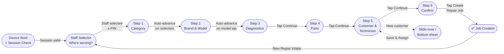

# Feature: New Customer Flow

> **Scope:** Slide-over drawer (tablet) and bottom sheet (smartphone) for creating a new customer during Step 5.

---

## Prerequisites

Triggered by tapping **"+ Create New Customer"** on [Step 5](pos-09-step5-customer-tech.md).

---

## Tablet — Slide-over Drawer

A panel slides in from the right, temporarily replacing the summary panel. Wizard content stays visible but dimmed. On save, drawer closes, new customer is auto-assigned, and the summary panel returns with the customer name populated.

```
┌─────────────────────────────────────────────────────┬──────────────────────────┐
│  Step 5 content                                      │  ✕  New Customer         │
│  (dimmed, non-interactive)                           │  ──────────────────────  │
│  ░░░░░░░░░░░░░░░░░░░░░░░░░░░░░░░░░░░░░░░░░░░░░░░░  │  Full Name               │
│  ░░░░░░░░░░░░░░░░░░░░░░░░░░░░░░░░░░░░░░░░░░░░░░░░  │  [ __________________ ]  │
│  ░░░░░░░░░░░░░░░░░░░░░░░░░░░░░░░░░░░░░░░░░░░░░░░░  │                          │
│  ░░░░░░░░░░░░░░░░░░░░░░░░░░░░░░░░░░░░░░░░░░░░░░░░  │  Phone                   │
│                                                      │  [ __________________ ]  │
│                                                      │                          │
│                                                      │  Email                   │
│                                                      │  [ __________________ ]  │
│                                                      │                          │
│                                                      │  Notes                   │
│                                                      │  [ __________________ ]  │
│                                                      │                          │
│                                                      │  [ Cancel ]  [ Save ✔ ]  │
└─────────────────────────────────────────────────────┴──────────────────────────┘
```

---

## Smartphone — Bottom Sheet

Sheet slides up from the bottom, covering the lower half of the screen. Background dims. Dismissible by tapping outside or the × button.

```
┌─────────────────────────────────┐
│  (Step 5 dimmed behind sheet)   │
│  ░░░░░░░░░░░░░░░░░░░░░░░░░░░░  │
│  ░░░░░░░░░░░░░░░░░░░░░░░░░░░░  │
├─────────────────────────────────┤
│  ╌╌╌  New Customer          ✕  │  ← bottom sheet handle
│  ─────────────────────────────  │
│  Full Name  [ ________________] │
│  Phone      [ ________________] │
│  Email      [ ________________] │
│  Notes      [ ________________] │
│                                 │
│  [        Save & Assign       ] │
└─────────────────────────────────┘
```

---

## New Customer Form Fields

| Field | Type | Required | Validation |
| --- | --- | --- | --- |
| Full Name | Text | Yes | Min 2 characters |
| Phone | Tel | Yes | Valid MY phone format |
| Email | Email | No | Valid email format if provided |
| Notes | Textarea | No | Free text |

---

## Behaviour

- Tapping Cancel closes the drawer/sheet; returns to Step 5 with no customer assigned
- Tapping Save validates the form; on success, creates the customer, closes the drawer/sheet, and auto-assigns the new customer on Step 5
- On save failure, inline field errors are shown within the drawer/sheet

---

## Wizard Context


