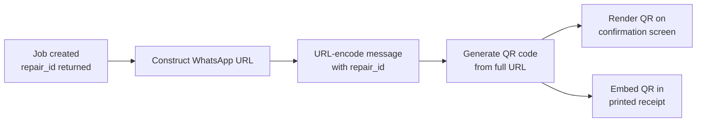

# Feature: Job Confirmation & WhatsApp QR

> **Scope:** Dead-end confirmation screen after successful job creation, WhatsApp QR code generation, and deep-link format.

---

## Prerequisites

Shown after successful repair job creation from [Step 6](pos-10-step6-confirm-create.md). This is a **dead-end screen** — no Back button.

The screen has two zones: a **job summary** on the left and a **WhatsApp QR code** on the right. Staff shows or hands the device to the customer so they can scan and follow progress.

---

## Tablet Layout

```
┌──────────────────────────────────────────────────────────────────────┐
│  [Logo]  RepairFlow POS         [Outlet Name]  [MY|EN]  [👤] │
├──────────────────────────────────────────────────────────────────────┤
│                                                                       │
│  ✅  Repair Job Created                                               │
│                                                                       │
│  ┌─────────────────────────────────┐  ┌──────────────────────────┐  │
│  │  Job ID     #RJ-20251024-0042   │  │                          │  │
│  │  Device     iPhone 16 Pro Max   │  │     ┌──────────────┐     │  │
│  │  Customer   Ali Evans           │  │     │              │     │  │
│  │  Tech       Hafiz Zain          │  │     │   QR CODE    │     │  │
│  │  Pickup     Oct 24, 2025        │  │     │              │     │  │
│  │                                 │  │     └──────────────┘     │  │
│  │  Issues                         │  │                          │  │
│  │  · Display/Screen               │  │  Scan to track your      │  │
│  │  · Battery                      │  │  repair on WhatsApp      │  │
│  │                                 │  │                          │  │
│  │  Grand Total     RM 514.10      │  │  #RJ-20251024-0042       │  │
│  └─────────────────────────────────┘  └──────────────────────────┘  │
│                                                                       │
│     [ 🖨  Print Receipt ]              [ + New Repair Intake ]       │
│                                                                       │
└──────────────────────────────────────────────────────────────────────┘
```

---

## Smartphone Layout

QR code stacks below the job summary. Customer can also tap the WhatsApp button directly since they are likely viewing this on a phone handed to them by staff.

```
┌─────────────────────────────────┐
│  [Logo]  POS    [Outlet]  [👤]  │
├─────────────────────────────────┤
│                                 │
│  ✅  Repair Job Created         │
│                                 │
│  Job ID   #RJ-20251024-0042     │
│  Device   iPhone 16 Pro Max     │
│  Customer Ali Evans             │
│  Tech     Hafiz Zain            │
│  Pickup   Oct 24, 2025          │
│  Total    RM 514.10             │
│                                 │
│  ┌─────────────────────────┐    │
│  │      ┌──────────┐       │    │
│  │      │          │       │    │
│  │      │ QR CODE  │       │    │
│  │      │          │       │    │
│  │      └──────────┘       │    │
│  │  Scan to track repair   │    │
│  │  on WhatsApp            │    │
│  │  #RJ-20251024-0042      │    │
│  └─────────────────────────┘    │
│                                 │
│  [ 💬  Open in WhatsApp ]       │  ← direct link, no scan needed
│                                 │
│  [ 🖨 Print ]  [ + New Intake ] │
│                                 │
└─────────────────────────────────┘
```

| Action | Behaviour |
| --- | --- |
| Scan QR | Opens WhatsApp with pre-filled message on customer's device |
| Open in WhatsApp | Smartphone only — direct deep link, bypasses QR scan |
| Print Receipt | Triggers print flow (see [Receipt Formats](pos-13-receipts.md)) |
| New Repair Intake | Clears all wizard state and restarts from Step 1 |

---

## WhatsApp QR Code

### QR Code Contents

The QR code encodes a WhatsApp deep link URL with a predefined message. When scanned, it opens WhatsApp on the customer's device with the message pre-filled and ready to send.

```
URL format:
https://wa.me/{SHOP_WHATSAPP_NUMBER}?text={ENCODED_MESSAGE}

Example:
https://wa.me/60123456789?text=Hi%2C+I+want+to+get+repair+progress+for+job+%23RJ-20251024-0042

Decoded message:
"Hi, I want to get repair progress for job #RJ-20251024-0042"
```

### URL Construction

```
┌─────────────────────────────────────────────────────────────────┐
│  Base URL      https://wa.me/                                   │
│  Phone         {outlet.whatsappNumber}  (configured per outlet) │
│  Query param   ?text={encodeURIComponent(message)}              │
│                                                                 │
│  Message template:                                              │
│  "Hi, I want to get repair progress for job #{repair_id}"       │
│                                                                 │
│  Final example:                                                 │
│  https://wa.me/60123456789                                      │
│    ?text=Hi%2C+I+want+to+get+repair+progress                   │
│         +for+job+%23RJ-20251024-0042                            │
└─────────────────────────────────────────────────────────────────┘
```

### QR Code Generation



| Property | Value |
| --- | --- |
| Library | e.g. `qrcode.js`, `react-qr-code` |
| Size | 180×180px on screen, 25mm×25mm on receipt |
| Error level | `M` (15% recovery — sufficient for print) |
| Colour | Black on white (monochrome, works on thermal) |
| Margin | 4 quiet-zone modules minimum |

### Verification — TBD

The predefined message contains the `repair_id`. When the customer sends it via WhatsApp, the shop's WhatsApp Business / chatbot receives the message and can:

- Match the `repair_id` to the job record
- Optionally verify the sender's phone number against the customer profile
- Reply with the current job status automatically

> **Note:** Full verification logic (phone number matching, chatbot integration, fallback handling) is out of scope for this spec and to be defined separately.
