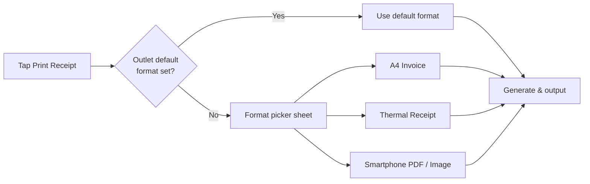
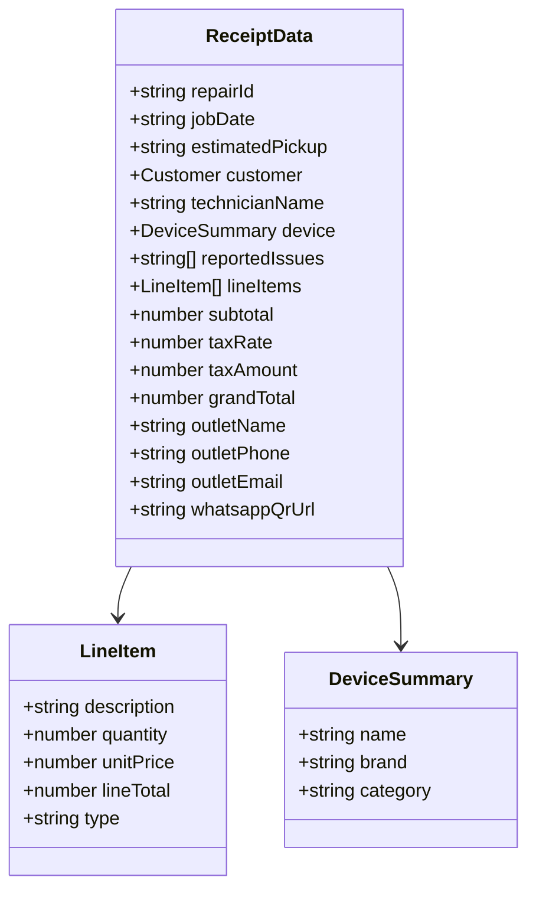

# Feature: Receipt Formats

> **Scope:** A4 invoice, thermal receipt, and smartphone PDF/image receipt formats with shared data model.

---

## Prerequisites

Three receipt formats are supported. All are generated from the same underlying data. The print action on the Job Confirmation screen prompts staff to select a format, or the outlet's default format is used if configured.



---

## Format 1 — A4 Invoice

Full-page professional invoice. Suitable for filing, warranty claims, or business customers. Triggered via browser print dialog (`window.print()`) with a dedicated print stylesheet.

```
┌──────────────────────────────────────────────────┐
│                                                   │  ← A4 (210mm × 297mm)
│  [LOGO]              RepairFlow                  │
│  ─────────────────────────────────────────────── │
│  Outlet Name         Tel: +60X-XXX XXXX          │
│  123 Jalan Example   outlet@repairflow.com        │
│  Kuala Lumpur                                     │
│                                                   │
│  ─────────────────────────────────────────────── │
│  REPAIR INVOICE                                   │
│                                                   │
│  Job ID     #RJ-20251024-0042                     │
│  Date       Oct 24, 2025                          │
│  Est. Pickup Oct 27, 2025                         │
│                                                   │
│  Customer   Ali Evans                             │
│             +601X-XXX XXXX                        │
│  Technician Hafiz Zain                            │
│                                                   │
│  Device     iPhone 16 Pro Max (Smartphone)        │
│                                                   │
│  Reported Issues                                  │
│  · Display/Screen                                 │
│  · Battery                                        │
│                                                   │
│  ─────────────────────────────────────────────── │
│  Parts & Labour                                   │
│                                                   │
│  iPhone 16 Pro Screen      1×       RM 320.00    │
│  iPhone 16 Battery         1×        RM  85.00   │
│  Labour Fee                           RM  80.00   │
│  ─────────────────────────────────────────────── │
│  Subtotal                             RM 485.00   │
│  Tax (6% SST)                          RM  29.10  │
│  ─────────────────────────────────────────────── │
│  GRAND TOTAL                          RM 514.10   │
│                                                   │
│  ─────────────────────────────────────────────── │
│  Track your repair progress via WhatsApp:         │
│                                                   │
│  ┌──────────┐  Scan this QR code or send          │
│  │          │  "Hi, I want to get repair           │
│  │ QR CODE  │  progress for job                   │
│  │  25×25mm │  #RJ-20251024-0042"                 │
│  └──────────┘  to +60X-XXX XXXX on WhatsApp       │
│                                                   │
│  ─────────────────────────────────────────────── │
│  Thank you for choosing RepairFlow.               │
│  For enquiries: outlet@repairflow.com             │
└──────────────────────────────────────────────────┘
```

| Property | Value |
| --- | --- |
| Size | A4 — 210mm × 297mm |
| Margins | 20mm all sides |
| Font | System serif or sans-serif, min 10pt body text |
| Trigger | `window.print()` with `@media print` stylesheet |
| QR code | Embedded, 25mm × 25mm, bottom of invoice |
| Colour | Black and white (no colour ink dependency) |

---

## Format 2 — Thermal Receipt

Narrow-width receipt for 80mm thermal POS printers. Monochrome only. No images except the QR code. Condensed layout — everything on one continuous roll.

```
─────────────────────────
      [LOGO / NAME]
      RepairFlow POS
  Outlet Name · KL Branch
  Tel: +60X-XXX XXXX
─────────────────────────
  REPAIR RECEIPT
─────────────────────────
  Job ID : #RJ-20251024-0042
  Date   : Oct 24, 2025
  Pickup : Oct 27, 2025
─────────────────────────
  Customer : Ali Evans
  Phone    : +601X-XXX XXXX
  Tech     : Hafiz Zain
─────────────────────────
  Device   : iPhone 16 Pro Max
  Issues   : Display, Battery
─────────────────────────
  PARTS & LABOUR
  iPhone 16 Screen
    1 × RM320.00    RM 320.00
  iPhone 16 Battery
    1 × RM 85.00     RM  85.00
  Labour Fee         RM  80.00
─────────────────────────
  Subtotal           RM 485.00
  SST (6%)            RM  29.10
─────────────────────────
  TOTAL              RM 514.10
─────────────────────────

  Track repair on WhatsApp:

  ┌──────────────────┐
  │                  │
  │    QR CODE       │
  │    (40mm×40mm)   │
  │                  │
  └──────────────────┘

  Or send this message to
  +60X-XXX XXXX on WhatsApp:
  "...progress for job
   #RJ-20251024-0042"

─────────────────────────
  Thank you!
─────────────────────────
```

| Property | Value |
| --- | --- |
| Paper width | 80mm (576px at 203dpi) — also supports 58mm roll |
| Font | Monospace, 10–12pt |
| Line width | ~32–42 chars depending on font size |
| Images | QR code only; no logo image (text fallback) |
| Trigger | Dedicated thermal print stylesheet or ESC/POS lib |
| QR code | 40mm × 40mm centred, near the bottom |
| Colour | Black on white only |

> For thermal printing, consider using a library such as `escpos` or connecting via WebUSB / WebBluetooth if printing directly from the browser on tablet. Server-side ESC/POS generation is the more reliable approach.

---

## Format 3 — Smartphone PDF / Image

A mobile-optimised single-page layout that the customer can save, share, or screenshot. Rendered as a shareable PDF or long-image. Triggered from the smartphone confirmation screen via the Share / Download action.

```
┌────────────────────────┐
│  [LOGO]  RepairFlow    │  ← ~390px wide
│  ────────────────────  │
│  REPAIR RECEIPT        │
│                        │
│  #RJ-20251024-0042     │
│  Oct 24, 2025          │
│  ────────────────────  │
│  Ali Evans             │
│  +601X-XXX XXXX        │
│  ────────────────────  │
│  iPhone 16 Pro Max     │
│  Display · Battery     │
│  ────────────────────  │
│  Screen      RM 320    │
│  Battery      RM  85   │
│  Labour       RM  80   │
│  ─────────────────     │
│  Subtotal    RM 485    │
│  SST (6%)     RM  29   │
│  ─────────────────     │
│  TOTAL       RM 514    │
│  ────────────────────  │
│                        │
│  ┌──────────────────┐  │
│  │                  │  │
│  │    QR CODE       │  │
│  │                  │  │
│  └──────────────────┘  │
│  Scan to track via     │
│  WhatsApp              │
│  ────────────────────  │
│  RepairFlow  ·  KL     │
└────────────────────────┘
```

| Property | Value |
| --- | --- |
| Width | 390px (renders well as screenshot or PDF) |
| Format | PDF (via `window.print()`) or PNG (via `html2canvas`) |
| Trigger | Share sheet on mobile → Save / WhatsApp / Email |
| QR code | Centred, ~120px × 120px |
| Colour | Light background, dark text; one accent colour okay |

---

## Receipt Data Model

All three formats share the same data source:


