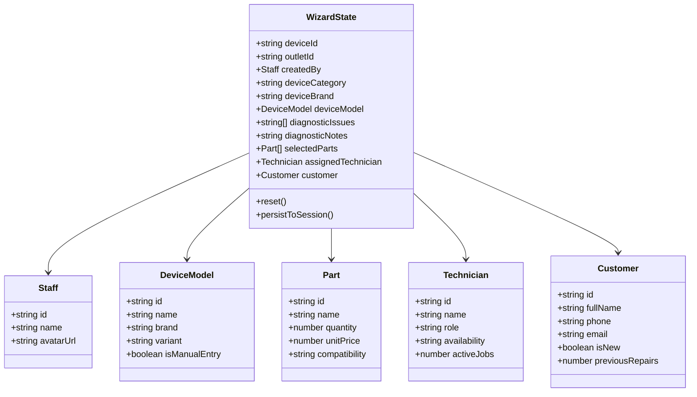
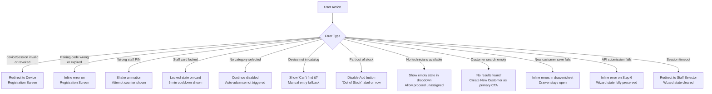

# Feature: Wizard State, Errors & Accessibility

> **Scope:** Wizard state management model, error and empty states, discard confirmation dialog, and touch/accessibility guidelines.

---

## Wizard State Management



> Persist wizard state to `sessionStorage` on every step change so that an accidental page refresh on the kiosk or tablet does not lose a partially completed intake.

---

## Error & Empty States



---

## Discard Confirmation Dialog

Triggered by tapping **"Cancel Intake"** on any step, or any unhandled navigation-away.

```
  ┌──────────────────────────────────────────┐
  │   Discard Repair Intake?                 │
  │                                          │
  │   All entered information will be lost   │
  │   and cannot be recovered.               │
  │                                          │
  │   [ Keep Editing ]        [ Discard ]    │
  └──────────────────────────────────────────┘
```

| Action | Behaviour |
| --- | --- |
| Keep Editing | Closes dialog; returns to current step, state intact |
| Discard | Clears all wizard state; returns to Step 1 |

---

## Touch & Accessibility Guidelines

### Tap Targets

| Element | Minimum size |
| --- | --- |
| Category cards | 80px height |
| Brand tiles | 56px height |
| Issue shortcut cards | 72px height |
| Parts Add [+] button | 48×48px |
| Qty stepper [−] [+] | 44×44px |
| Customer cards | 64px height |
| Continue / Back | 52px height, full row |
| Technician list rows | 64px height |

### Keyboard Behaviour (Soft Keyboard on Mobile)

- When a search bar or text field is focused, the layout scrolls to keep the field visible above the soft keyboard
- Sticky action bar remains anchored above the keyboard, not behind it
- Summary peek bar on smartphone is hidden while keyboard is open to maximise space

### Other Touch Considerations

- No hover-dependent interactions anywhere in the flow
- All interactive elements have visible pressed/active states
- Swipe-left on a selected parts row reveals a delete affordance on tablet
- Drag-to-reorder is not required for parts in this version
