# POS Portal — Frontend Specification

## Feature: New Repair Intake (Multi-Step Flow)

> **Last updated:** v1.0 final — all design decisions incorporated
> **Primary device:** Tablet / iPad
> **Secondary device:** Smartphone (on-the-go POS)

---

## Table of Contents

1. [Overview](#overview)
2. [Authentication Model](#authentication-model)
3. [Device Boot Flow](#device-boot-flow)
4. [Staff Selector Screen](#staff-selector-screen)
5. [Application Shell](#application-shell)
6. [Responsive Layout Strategy](#responsive-layout-strategy)
7. [Multi-Step Wizard Flow](#multi-step-wizard-flow)
8. [Step Progress Indicator](#step-progress-indicator)
9. [Navigation Pattern](#navigation-pattern)
10. [Persistent Summary Panel](#persistent-summary-panel)
11. [Step 1 — Device Category](#step-1--device-category)
12. [Step 2 — Brand & Model](#step-2--brand--model)
13. [Step 3 — Device Diagnostics](#step-3--device-diagnostics)
14. [Step 4 — Parts](#step-4--parts)
15. [Step 5 — Customer & Technician](#step-5--customer--technician)
16. [Step 6 — Confirm & Create](#step-6--confirm--create)
17. [New Customer Flow](#new-customer-flow)
18. [Job Confirmation Screen](#job-confirmation-screen)
19. [WhatsApp QR Code](#whatsapp-qr-code)
20. [Receipt Formats](#receipt-formats)
21. [Wizard State Management](#wizard-state-management)
22. [Error & Empty States](#error--empty-states)
23. [Discard Confirmation Dialog](#discard-confirmation-dialog)
24. [Touch & Accessibility Guidelines](#touch--accessibility-guidelines)

---

## Overview

The New Repair Intake is the primary transaction flow of the POS portal. It is a **6-step
linear wizard** that guides front desk staff through creating a complete repair job — from
device identification to customer and technician assignment and final invoice confirmation.

The POS portal is a **fully locked, single-purpose interface**. There is no navigation,
no sidebar, and no way to access other areas of the system. Every interaction is scoped
entirely to the repair intake flow.

The interface is **designed first for tablet and iPad**, with full support for smartphone
as a secondary on-the-go POS device. Layouts, tap targets, and interaction patterns are
optimised for touch throughout.

---

## Authentication Model

The POS portal uses a **two-layer identity model**. Device identity and staff identity
are separate concerns handled at different points in the flow.

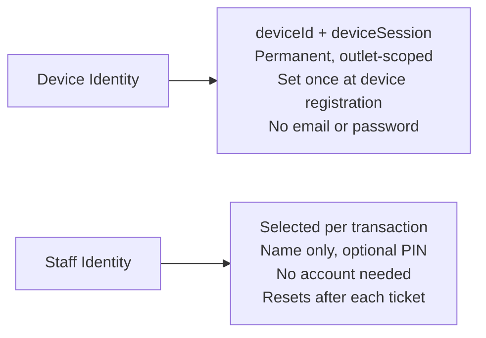

| Layer           | Belongs to                  | Lifetime              | Set by                             |
| --------------- | --------------------------- | --------------------- | ---------------------------------- |
| `deviceId`      | The physical device         | Permanent             | Outlet manager during setup        |
| `deviceSession` | The device–outlet link      | Long-lived, revocable | Issued on registration             |
| `staffId`       | The individual staff member | Per transaction       | Staff taps name before each intake |

**Why this model:**

- POS devices belong to outlets, not people — no per-user login needed
- Not all front desk staff have email addresses
- Fast boot is critical for a kiosk environment
- Staff accountability is still maintained through per-ticket attribution
- The outlet manager revokes a device from the tenant portal, not by changing a password

---

## Device Boot Flow

Runs once when the app first loads on a new or unregistered device, and again if the
`deviceSession` is missing, expired, or revoked.

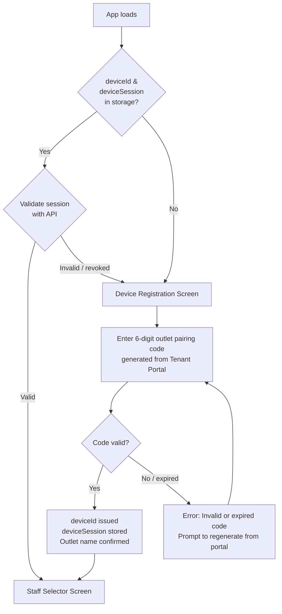

### Device Registration Screen

A one-time setup screen. The outlet manager generates a pairing code from the Tenant
Portal and hands or displays it to whoever is setting up the POS device.

```
┌──────────────────────────────────────────────────────────┐
│                                                          │
│            [Logo]  RepairFlow POS                        │
│                                                          │
│         ┌────────────────────────────────────┐           │
│         │                                    │           │
│         │   Device Setup                     │           │
│         │                                    │           │
│         │   Enter the 6-digit pairing code   │           │
│         │   from your Tenant Portal.         │           │
│         │                                    │           │
│         │   [ _ _ _ ] – [ _ _ _ ]            │           │
│         │                                    │           │
│         │   Code expires after 10 minutes.   │           │
│         │                                    │           │
│         │   [ Confirm ]                      │           │
│         │                                    │           │
│         └────────────────────────────────────┘           │
│                                                          │
│         Need help? Contact your outlet manager.          │
│                                                          │
└──────────────────────────────────────────────────────────┘
```

| Property            | Value                                                      |
| ------------------- | ---------------------------------------------------------- |
| Pairing code format | 6 digits, split `XXX–XXX` for readability                  |
| Code lifetime       | 10 minutes from generation in Tenant Portal                |
| On success          | `deviceId` and `deviceSession` stored in `localStorage`    |
| On failure          | Inline error, prompt to try again or regenerate code       |
| Re-registration     | Existing session is replaced; previous session invalidated |

### Session Storage

```
localStorage:
  rms_device_id       = "dev_abc123xyz"
  rms_device_session  = "dses_..."
  rms_outlet_name     = "KL Branch"
  rms_outlet_id       = "out_456"
```

> These keys are read on every app load. If either `rms_device_id` or
> `rms_device_session` is missing, the device registration screen is shown regardless
> of other stored state.

---

## Staff Selector Screen

Shown after device session is validated — before every new repair intake. This is where
staff identify themselves as the creator of the upcoming ticket. It resets automatically
after each completed ticket so the next transaction always starts fresh.

The staff list is fetched from the outlet's staff roster (scoped to the outlet linked
to this device). No email, no password — staff members only need to exist in the system.

### Tablet Layout

```
┌───────────────────────────────────────────────────────────────────────┐
│  [Logo]  RepairFlow POS                    [KL Branch]  [MY|EN]  [👤] │
├───────────────────────────────────────────────────────────────────────┤
│                                                                       │
│                      Who's serving?                                   │
│                   Select your name to begin                           │
│                                                                       │
│   ┌─────────────┐  ┌─────────────┐  ┌─────────────┐                   │
│   │     👤      │  │     👤      │  │     👤      │                   │
│   │             │  │             │  │             │                   │
│   │   Ahmad     │  │   Nurul     │  │    Hafiz    │                   │
│   │   Faris     │  │    Ain      │  │    Zain     │                   │
│   └─────────────┘  └─────────────┘  └─────────────┘                   │
│   ┌─────────────┐  ┌─────────────┐                                    │
│   │     👤      │  │     👤      │                                    │
│   │             │  │             │                                    │
│   │    Amir     │  │    Siti     │                                    │
│   │   Hamzah    │  │  Norsiah    │                                    │
│   └─────────────┘  └─────────────┘                                    │
│                                                                       │
└───────────────────────────────────────────────────────────────────────┘
```

### Smartphone Layout

```
┌─────────────────────────────────┐
│  [Logo]  POS        [KL Branch] │
├─────────────────────────────────┤
│                                 │
│       Who's serving?            │
│   Select your name to begin     │
│                                 │
│  ┌──────────┐  ┌──────────┐     │
│  │    👤    │  │    👤    │     │
│  │  Ahmad   │  │  Nurul   │     │
│  │  Faris   │  │   Ain    │     │
│  └──────────┘  └──────────┘     │
│  ┌──────────┐  ┌──────────┐     │
│  │    👤    │  │    👤    │     │
│  │  Hafiz   │  │   Amir   │     │
│  │   Zain   │  │  Hamzah  │     │
│  └──────────┘  └──────────┘     │
│  ┌──────────┐                   │
│  │    👤    │                   │
│  │   Siti   │                   │
│  │ Norsiah  │                   │
│  └──────────┘                   │
│                                 │
└─────────────────────────────────┘
```

### Optional PIN Confirmation

If the outlet has PIN verification enabled (configured in Tenant Portal), tapping a
staff card triggers a PIN prompt before the wizard begins.

```
┌─────────────────────────────────────────────┐
│                                             │
│   👤  Ahmad Faris                           │
│   Enter your PIN                            │
│                                             │
│        [ ● ] [ ● ] [   ] [   ]              │  ← masked dots
│                                             │
│   [ 1 ]  [ 2 ]  [ 3 ]                       │
│   [ 4 ]  [ 5 ]  [ 6 ]                       │
│   [ 7 ]  [ 8 ]  [ 9 ]                       │
│   [ ← ]  [ 0 ]  [ ✕ ]                       │
│                                             │
└─────────────────────────────────────────────┘
```

| Property     | Value                                                        |
| ------------ | ------------------------------------------------------------ |
| PIN length   | 4 digits                                                     |
| Wrong PIN    | Shake animation, counter shown (e.g. "2 attempts remaining") |
| Locked out   | After 5 wrong attempts, card is locked for 5 minutes         |
| PIN optional | Outlet manager enables/disables per outlet in Tenant Portal  |

### Staff Selector Flow

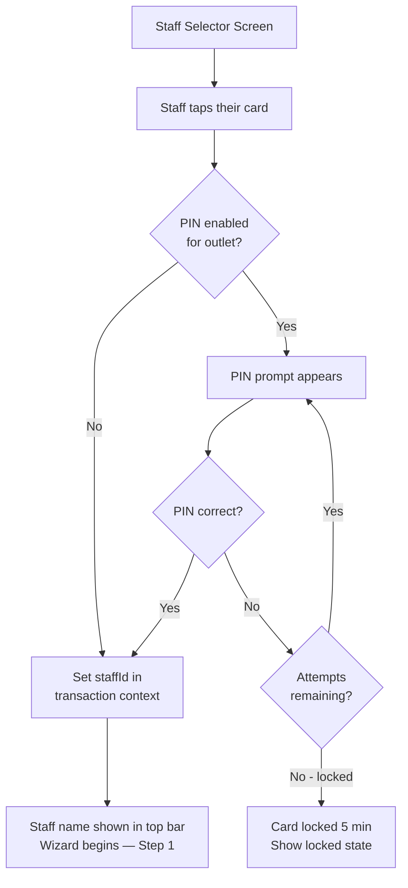

### Staff Identity in Top Bar

Once a staff member is selected, their name appears in the top bar for the full duration
of the transaction. Tapping their name shows a quick-switch option.

```
┌─────────────────────────────────────────────────────────────────────────┐
│  [Logo]  RepairFlow POS         [KL Branch]  [MY|EN]  [👤] Ahmad Faris  │
└─────────────────────────────────────────────────────────────────────────┘
```

Tapping `👤 Ahmad Faris` opens a small popover:

```
  ┌─────────────────────────┐
  │  👤  Ahmad Faris        │
  │  KL Branch              │
  │  ─────────────────────  │
  │  Switch staff member    │  ← returns to staff selector, wizard state preserved
  │  Cancel intake          │  ← triggers discard confirmation dialog
  └─────────────────────────┘
```

> **Note:** Switching staff mid-intake preserves all wizard state. Only the
> `created_by` field on the ticket is updated to the newly selected staff member.

### Ticket Attribution

| Field                 | Value                             | Source         |
| --------------------- | --------------------------------- | -------------- |
| `created_by`          | Staff selected on selector screen | Staff Selector |
| `assigned_technician` | Technician chosen in Step 5       | Step 5         |
| `device_id`           | Device identifier                 | `localStorage` |
| `outlet_id`           | Outlet linked to device           | `localStorage` |

These are distinct — the front desk staff who created the ticket and the technician
assigned to repair it can be, and often are, different people.

---

## Application Shell

### Tablet Layout

```
┌────────────────────────────────────────────────────────────────────────────────────────────────┐
│  [Logo]   ✓ > ✓ > ✓ > 3 issues > 2 parts > Customer & Tech > Summary  [KL Branch] [MY|EN] [👤] │
├────────────────────────────────────────────────────────────────────────────────────────────────┤
│                                                                                                │
│                                     [ Wizard Content ]                                         │
│                                                                                                │
├────────────────────────────────────────────────────────────────────────────────────────────────┤
│  [ ◀  Previous ]                                                             [ Continue  ▶ ]   │
└────────────────────────────────────────────────────────────────────────────────────────────────┘
```

### Smartphone Layout

Breadcrumb drops to a dedicated scrollable second row below the top bar.

```
┌──────────────────────────────────────────────────────────┐
│  [Logo]                            [KL Branch] [EN] [👤] │
├──────────────────────────────────────────────────────────┤
│  ← ✓ > ✓ > ✓ > 3 issues > 2 parts > Customer ... →       │  ← scrollable row
├──────────────────────────────────────────────────────────┤
│                                                          │
│                    [ Wizard Content ]                    │
│                                                          │
├──────────────────────────────────────────────────────────┤
│  [ ◀  Previous ]                        [ Continue  ▶ ]  │
├──────────────────────────────────────────────────────────┤
│  RM 561.00  ·  Step 4 of 6                             ▲ │
└──────────────────────────────────────────────────────────┘
```

### Top Bar Elements

| Element         | Description                                                                        |
| --------------- | ---------------------------------------------------------------------------------- |
| Logo            | Tapping does nothing — POS is a locked interface                                   |
| Breadcrumb      | Dynamic, centred (tablet) / scrollable second row (mobile). See Breadcrumb section |
| Outlet badge    | Current outlet name in a pill/badge. Read-only                                     |
| Language toggle | `MY \| EN` — switches UI language. Persisted to localStorage                       |
| Avatar icon     | Tappable — opens staff popover dropdown                                            |

### Avatar Popover

```
                                              ┌─────────────────────────┐
                                              │  👤  Ahmad Faris        │
                                              │  KL Branch              │
                                              │  ─────────────────────  │
                                              │  Switch staff member    │
                                              │  Cancel intake          │
                                              └─────────────────────────┘
                                                                      [👤]
```

| Action              | Behaviour                                                      |
| ------------------- | -------------------------------------------------------------- |
| Switch staff member | Returns to Staff Selector screen; wizard state fully preserved |
| Cancel intake       | Triggers discard confirmation dialog                           |

### Language Toggle

Two-option toggle. Switches all UI labels, placeholders, and system text instantly.
Staff-selected language is stored in `localStorage` and persists across sessions.

```
[ MY | EN ]   ←  active option is highlighted
```

| Code | Language        |
| ---- | --------------- |
| `MY` | Bahasa Malaysia |
| `EN` | English         |

The only intentional exit points from the POS portal are:

- **Successful job creation** → redirects to the Job Confirmation screen
- **Session timeout** → redirects to the Staff Selector screen
- **Cancel Intake** via avatar popover → triggers a discard confirmation dialog

---

## Responsive Layout Strategy

The layout adapts across three breakpoints based on the primary and secondary devices.

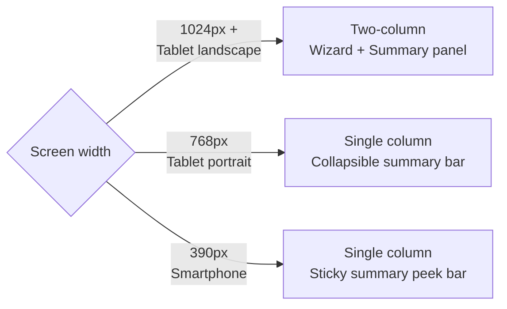

---

### Tablet Landscape — 1024px+ (Primary)

Two-column layout. Wizard content on the left, persistent summary panel on the right.
Breadcrumb centred in the top bar.

```
┌─────────────────────────────────────────────────────────────────────────────────────────────┐
│  [Logo]   ✓ > ✓ > 3 issues > 2 parts > Customer & Tech > Summary   [KL Branch] [MY|EN] [👤] │
├─────────────────────────────────────────────────────────────────────────────────────────────┤
│                                              │                                              │
│       Wizard Content                         │     Persistent Summary Panel                 │
│       (fills left area)                      │     (fixed right, scrollable)                │
│                                              │                                              │
├─────────────────────────────────────────────────────────────────────────────────────────────┤
│  [ ◀  Previous ]                                                           [ Continue  ▶ ]  │
└─────────────────────────────────────────────────────────────────────────────────────────────┘
```

---

### Tablet Portrait — 768px (Secondary)

Breadcrumb stays in the top bar but may truncate. Summary collapses to a tappable bar.

```
┌───────────────────────────────────────────────────────────┐
│  [Logo]  ✓ > ✓ > 3 issues > 2 parts > ...  [KL] [EN] [👤] │
├───────────────────────────────────────────────────────────┤
│  📱 iPhone 16 Pro Max  ·  RM 561.00  ·  4 of 6         ▾  │  ← Collapsed summary bar
├───────────────────────────────────────────────────────────┤
│                                                           │
│              Wizard Content (full width)                  │
│                                                           │
├───────────────────────────────────────────────────────────┤
│  [ ◀  Previous ]                         [ Continue  ▶ ]  │
└───────────────────────────────────────────────────────────┘
```

---

### Smartphone — 390px (On-the-go POS)

Top bar shows logo and right-side icons only. Breadcrumb drops to a dedicated
horizontally scrollable second row.

```
┌────────────────────────────────────────────────────────────┐
│  [Logo]                              [KL Branch] [EN] [👤] │
├────────────────────────────────────────────────────────────┤
│  ← ✓ > ✓ > 3 issues > 2 parts > Customer & Tech > ... →.   │  ← scrollable breadcrumb row
├────────────────────────────────────────────────────────────┤
│                                                            │
│         Wizard Content (full width, scrollable)            │
│                                                            │
├────────────────────────────────────────────────────────────┤
│  [ ◀  Previous ]                          [ Continue  ▶ ]  │
├────────────────────────────────────────────────────────────┤
│  RM 561.00  ·  Step 4 of 6                             ▲   │  ← Sticky summary peek bar
└────────────────────────────────────────────────────────────┘
```

---

## Multi-Step Wizard Flow

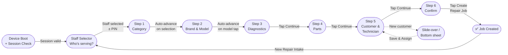

---

## Dynamic Breadcrumb

Replaces the static step progress indicator entirely. Lives in the top bar on tablet
and in a dedicated scrollable second row on smartphone. Tapping a completed crumb
navigates back to that step.

### Breadcrumb States

| State                            | Display                                  | Tappable             |
| -------------------------------- | ---------------------------------------- | -------------------- |
| Upcoming step — nothing selected | Step label (e.g. `Diagnostic`)           | No — muted           |
| Current step — active            | Step label, highlighted                  | No                   |
| Completed, single selection      | `✓` icon                                 | Yes — navigates back |
| Completed, multi-selection       | Count label (e.g. `3 issues`, `2 parts`) | Yes — navigates back |

### Progression Example

```
Initial (nothing selected):
Category  >  Brand  >  Model  >  Diagnostic  >  Parts  >  Customer & Tech  >  Summary

After Step 1 (Smartphone selected):
✓  >  Brand  >  Model  >  Diagnostic  >  Parts  >  Customer & Tech  >  Summary

After Step 2 (iPhone 13 Pro selected — brand and model both collapse to ✓):
✓  >  ✓  >  Diagnostic  >  Parts  >  Customer & Tech  >  Summary

After Step 3 (3 issues selected):
✓  >  ✓  >  3 issues  >  Parts  >  Customer & Tech  >  Summary

After Step 4 (2 parts added):
✓  >  ✓  >  3 issues  >  2 parts  >  Customer & Tech  >  Summary

After Step 5 (customer and tech assigned):
✓  >  ✓  >  3 issues  >  2 parts  >  ✓  >  Summary
```

> **Why brand and model both collapse to ✓:**
> Brand is a filter, not a final decision — the model tap is the decisive action.
> Collapsing both keeps the breadcrumb compact.

### Count Label Format

| Step                 | Label format               | Example               |
| -------------------- | -------------------------- | --------------------- |
| Step 3 — Diagnostics | `{n} issue` / `{n} issues` | `1 issue`, `3 issues` |
| Step 4 — Parts       | `{n} part` / `{n} parts`   | `1 part`, `2 parts`   |

### Tappable Completed Crumb Behaviour

Tapping a completed `✓` or count label navigates back to that step. If downstream
steps have data that may be affected, a cascade warning dialog appears first
(see Reselection Cascade Rules).

```
✓  >  ✓  >  3 issues  >  2 parts  >  Customer & Tech  >  Summary
↑          ↑           ↑
tappable   tappable    tappable — navigates back to Step 3
```

### Reselection Cascade Rules

When a completed crumb is tapped and the selection is changed, downstream data is
evaluated for compatibility and selectively cleared with a warning.

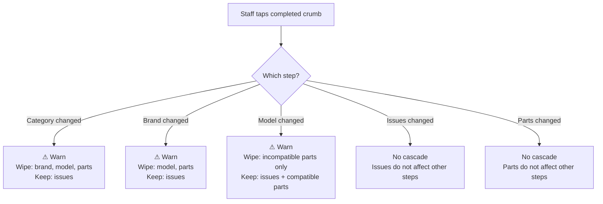

**Cascade warning dialog (example — model change):**

```
┌──────────────────────────────────────────────────┐
│  ⚠  Changing the model may affect your parts     │
│                                                  │
│  Will be removed (incompatible):                 │
│  · iPhone 13 Pro Screen                          │
│                                                  │
│  Will be kept (compatible or universal):         │
│  · USB-C Cable                                   │
│                                                  │
│  [ Cancel ]              [ Continue anyway ]     │
└──────────────────────────────────────────────────┘
```

| Action          | Behaviour                                             |
| --------------- | ----------------------------------------------------- |
| Cancel          | Closes dialog; stays on current step; no changes made |
| Continue anyway | Applies cascade; navigates back to the tapped step    |

> **Note:** Full compatibility data model (which parts are device-specific vs universal)
> is a backend concern and out of scope for this spec. The UI spec assumes the API
> returns a compatibility flag per selected part when a reselection occurs.

---

## Navigation Pattern

Different steps use different navigation patterns based on the nature of their input.

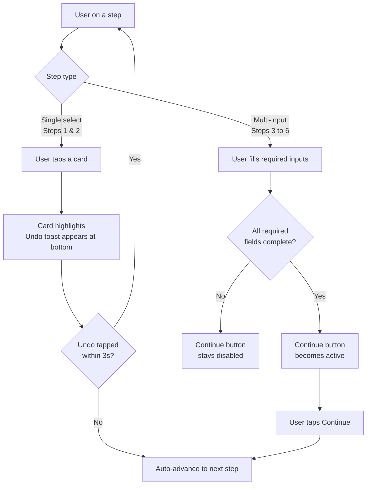

### Auto-Advance (Steps 1 & 2)

Applies to steps where a single decisive tap completes the step entirely.

- Card is tapped → highlights with active state
- A brief undo toast appears at the bottom of the screen for 3 seconds
- After 3 seconds (or if toast is dismissed), the wizard advances automatically
- Tapping **Undo** in the toast snaps back to the current step with selection cleared

```
  [ Smartphone selected                        Undo ]   ← toast, 3s
```

### Sticky Action Bar (Steps 3–6)

Applies to steps with multiple inputs, additive actions, or irreversible submission.

```
Tablet
┌──────────────────────────────────────────────────────────┐
│  [ ◀  Previous ]                        [ Continue  ▶ ]  │
└──────────────────────────────────────────────────────────┘

Smartphone
┌──────────────────────────────────────────────────────────┐
│  [ ◀  Previous ]                        [ Continue  ▶ ]  │
├──────────────────────────────────────────────────────────┤
│  $561.00  ·  Step 4 of 6                              ▲  │
└──────────────────────────────────────────────────────────┘
```

On Step 6, Continue is replaced by the primary submission CTA:

```
┌──────────────────────────────────────────────────────────┐
│  [ ◀  Previous ]               [ ✔  Create Repair Job ]  │
└──────────────────────────────────────────────────────────┘
```

---

## Persistent Summary Panel

Visible on tablet landscape throughout all steps. Progressively fills as the user advances.
Collapses to a bar/sheet on tablet portrait and smartphone.

```
┌─────────────────────────┐
│  Repair Summary         │
│  ─────────────────────  │
│  📱 iPhone 16 Pro Max   │  ← populated from Step 2
│  Smartphone             │  ← populated from Step 1
│                         │
│  Issues                 │  ← populated from Step 3
│  · Display/Screen       │
│  · Battery              │
│                         │
│  Parts                  │  ← populated from Step 4
│  · Screen      $320     │
│  · Battery      $85     │
│                         │
│  Tech     Hafiz Zain    │  ← populated from Step 5
│  Customer  Ali Evans    │  ← populated from Step 5
│                         │
│  ─────────────────────  │
│  Est. Total   $561.00   │  ← updates live from Step 4
└─────────────────────────┘
```

| State                 | Display                                           |
| --------------------- | ------------------------------------------------- |
| Field not yet reached | `—` placeholder                                   |
| Field in progress     | Live update as user interacts                     |
| Field completed       | Populated value, muted style                      |
| Running total         | Always shows current parts subtotal + est. labour |

---

## Step 1 — Device Category

**Navigation:** Auto-advance on card tap

```
┌──────────────────────────────────────────────────────────────────────────────────────────────────────────────┐
│  [Logo]  Category > Brand > Model > Diagnostic > Parts > Customer & Tech > Summary  [KL Branch] [MY|EN] [👤] │
├────────────────────────────────────────────────────────────────────────────────┬─────────────────────────────┤
│                                                                                │  Repair Summary             │
│                             New Repair Intake                                  │  ─────────────────────────  │
│                      Select the device type to get started                     │  Parts                   —  │
│                                                                                │  Tech                    —  │
│                   ┌───────────┐  ┌───────────┐  ┌───────────┐                  │  Customer                —  │
│                   │   [icon]  │  │   [icon]  │  │   [icon]  │                  │  ─────────────────────────  │
│                   │Smartphone │  │  Laptop   │  │  Tablet   │                  │  Est. Total              —  │
│                   └───────────┘  └───────────┘  └───────────┘                  │                             │
│                   ┌───────────┐  ┌───────────┐  ┌───────────┐                  │                             │
│                   │   [icon]  │  │   [icon]  │  │   [icon]  │                  │                             │
│                   │ Wearable  │  │  Console  │  │   Other   │                  │                             │
│                   └───────────┘  └───────────┘  └───────────┘                  │                             │
│                                                                                │                             │
│                 ┌──────────────────────────────────────────────┐               │                             │
│                 │ ⚠  Standard Inspection Fee applies to all    │               │                             │
│                 │    new intakes. Reflected in final estimate. │               │                             │
│                 └──────────────────────────────────────────────┘               │                             │
│                                                                                │                             │
│  [✕ Cancel Intake]                                                             │                             │
└────────────────────────────────────────────────────────────────────────────────┴─────────────────────────────┘
```

### UI Components

| Component             | Description                                                        |
| --------------------- | ------------------------------------------------------------------ |
| Category grid         | 6 tappable icon cards in a 3×2 layout; min 80px height per card    |
| Card states           | Default / Pressed / Selected (highlighted border + tint)           |
| Inspection Fee banner | Dismissible info banner                                            |
| Cancel Intake         | Ghost button, always visible, triggers discard confirmation dialog |

### Behaviour

- Single selection only; tapping another card deselects the previous
- On tap → card highlights → undo toast → auto-advance after 3s
- No Continue button on this step

---

## Step 2 — Brand & Model

**Navigation:** Auto-advance on model card tap

```
┌───────────────────────────────────────────────────────────────────────────────────────────────────────┐
│  [Logo]  ✓ > Brand & Model > Diagnostic > Parts > Customer & Tech > Summary  [KL Branch] [MY|EN] [👤] │
├───────────────────────────────────────────────────────────────────────────┬───────────────────────────┤
│                                                                           │  Repair Summary           │
│                  Identify the Device                                      │  ─────────────────────    │
│                                                                           │  📱 —                     │
│                  [ 🔍  Search brand, model or part number...   ]          │  Smartphone               │
│                                                                           │  Issues        —          │
│                  Select Brand                                             │  Parts         —          │
│                  ┌──────┐ ┌──────┐ ┌──────┐ ┌──────┐ ┌──────┐             │  Tech          —          │
│                  │APPLE │ │SAMSG │ │GOOGL │ │HUAWEI│ │  +   │             │  Customer      —          │
│                  └──────┘ └──────┘ └──────┘ └──────┘ └──────┘             │  ─────────────────────    │
│                                               ← scrollable →              │  Est. Total    —          │
│                                                                           │                           │
│  [✕ Cancel Intake]                                                        │                           │
└───────────────────────────────────────────────────────────────────────────┴───────────────────────────┘
```

After tapping a brand — brand row collapses, model grid expands to fill the space:

```
┌──────────────────────────────────────────────────────────────────────────────────┐
│  [Logo]  ✓ > Brand & Model > Diagnostic > Parts > Customer & Tech > Summary  [KL Branch] [MY|EN] [👤] │
├─────────────────────────────────────────────────────┬───────────────────────────┤
│                                                      │  Repair Summary           │
│  Identify the Device                                 │  ─────────────────────    │
│                                                      │  📱 —                     │
│  [ 🔍  Search brand, model or part number...   ]    │  Smartphone               │
│                                                      │                           │
│  [ 🍎 Apple  × ]  Change brand                      │                           │  ← collapsed badge
│  ─────────────────────────────────────────────────  │                           │
│  ┌──────────┐ ┌──────────┐ ┌──────────┐ ┌────────┐ │                           │
│  │ [image]  │ │ [image]  │ │ [image]  │ │[image] │ │                           │
│  │iPhone 16 │ │iPhone 16 │ │iPhone 15 │ │iPhone  │ │                           │
│  │ Pro Max  │ │   Pro    │ │ Pro Max  │ │   14   │ │                           │
│  └──────────┘ └──────────┘ └──────────┘ └────────┘ │                           │
│  ┌──────────┐ ┌──────────┐ ┌──────────┐ ┌────────┐ │                           │
│  │ [image]  │ │ [image]  │ │ [image]  │ │[image] │ │                           │
│  │iPhone 13 │ │iPhone 13 │ │  iPad    │ │MacBook │ │                           │
│  │  Pro Max │ │   Pro    │ │   Pro    │ │  Pro   │ │                           │
│  └──────────┘ └──────────┘ └──────────┘ └────────┘ │                           │
│                               ← scrollable grid →   │                           │
│                                                      │                           │
│  ┌────────────────────────────────────┐             │                           │
│  │  Can't find it? Enter manually →  │             │                           │
│  └────────────────────────────────────┘             │                           │
│                                                      │                           │
│  [✕ Cancel Intake]                                  │                           │
└─────────────────────────────────────────────────────┴───────────────────────────┘
```

After model tapped — breadcrumb updates, auto-advance begins:

```
[Logo]  ✓ > iPhone 16 Pro Max > Diagnostic > Parts > Customer & Tech > Summary  ...
```

### UI Components

| Component        | Description                                                                           |
| ---------------- | ------------------------------------------------------------------------------------- |
| Search bar       | Full-text search across all brands and models; always visible                         |
| Brand selector   | Horizontally scrollable row; collapses to badge on brand tap                          |
| Brand badge      | `[ 🏷 BrandName × ]  Change brand` — tapping × or Change re-expands row, clears model |
| Model grid       | Expands to fill full width after brand collapses; scrollable                          |
| Model card       | Device image, name, variant tag; min 100px height for touch                           |
| "Can't find it?" | Inline text input for manual device name; appears below model grid                    |

### Behaviour

- Brand tap → brand row animates out → brand badge appears → model grid expands
- Tapping `×` on brand badge or "Change brand" → model grid hides → brand row re-expands → model selection cleared
- Search bar overrides the brand/model flow entirely — results shown as a flat list
- Model tap → highlights briefly → undo toast → auto-advance after 3s
- Breadcrumb updates from `Brand & Model` to the selected model name on tap
- Manual entry confirms as a model selection and triggers auto-advance

---

## Step 3 — Device Diagnostics

**Navigation:** Sticky action bar (multi-select, no clear "done" signal)

```
┌──────────────────────────────────────────────────────────────────────────────────┐
│  [Logo]  ✓ > iPhone 16 Pro Max > Diagnostic > Parts > Customer & Tech > Summary  [KL Branch] [MY|EN] [👤] │
├─────────────────────────────────────────────────────┬───────────────────────────┤
│                                                      │  Repair Summary           │
│  Device Diagnostics                                  │  ─────────────────────    │
│                                                      │                           │
│  ┌──────────────────────────────────────────────┐   │  Issues                   │
│  │ ℹ  Inspect device with the customer present. │   │  · Display/Screen ←live   │
│  │    Select all visible and reported issues.   │   │  · Battery        ←live   │
│  └──────────────────────────────────────────────┘   │                           │
│                                                      │  Parts         —          │
│  Customer Issues      [ iPhone 16 Pro Max  × ]      │  Tech          —          │
│                                                      │  Customer      —          │
│  ┌─────────┐ ┌─────────┐ ┌─────────┐ ┌─────────┐  │  ─────────────────────    │
│  │ [icon]  │ │ [icon]  │ │ [icon]  │ │ [icon]  │  │  Est. Total    —          │
│  │ Display │ │ Battery │ │Charging │ │  Audio  │  │                           │
│  │ ✓ active│ │ ✓ active│ │  Port   │ │         │  │                           │
│  └─────────┘ └─────────┘ └─────────┘ └─────────┘  │                           │
│  ┌─────────┐ ┌─────────┐ ┌─────────┐ ┌─────────┐  │                           │
│  │ [icon]  │ │ [icon]  │ │ [icon]  │ │ [icon]  │  │                           │
│  │ Camera  │ │ Network │ │  Water  │ │  Other  │  │                           │
│  │         │ │         │ │ Damage  │ │         │  │                           │
│  └─────────┘ └─────────┘ └─────────┘ └─────────┘  │                           │
│                                                      │                           │
│  Other Issue / Specific Notes                        │                           │
│  ┌──────────────────────────────────────────────┐   │                           │
│  │  Describe additional issues here...          │   │                           │
│  └──────────────────────────────────────────────┘   │                           │
│                                                      │                           │
│  [✕ Cancel]                                         │                           │
├─────────────────────────────────────────────────────┴───────────────────────────┤
│  [ ◀  Previous ]                                        [ Continue  ▶ ]         │
└──────────────────────────────────────────────────────────────────────────────────┘
```

### UI Components

| Component            | Description                                                          |
| -------------------- | -------------------------------------------------------------------- |
| Diagnostics Note     | Dismissible info banner                                              |
| Issues grid          | Multi-select tappable cards; min 72px height; active state on select |
| Device context badge | Shows model from Step 2; tapping × returns to Step 2                 |
| Specific Notes       | Freetext textarea for details beyond the shortcut cards              |

### Behaviour

- Multiple issue cards can be selected simultaneously
- Summary panel issues list updates live with each tap
- At least one card **or** a non-empty notes field required to enable Continue

---

## Step 4 — Parts

**Navigation:** Sticky action bar (additive, user decides when list is complete)

```
┌──────────────────────────────────────────────────────────────────────────────────┐
│  [Logo]  ✓ > ✓ > 3 issues > Parts > Customer & Tech > Summary  [KL Branch] [MY|EN] [👤] │
├─────────────────────────────────────────────────────┬─────────────────────────────┤
│                                                      │  Repair Summary             │
│  Select Parts                                        │  ─────────────────────────  │
│                                                      │  📱 iPhone 16 Pro Max       │
│                                                      │                         │
│  [ 🔍  Search parts or SKU...                  ]    │  Issues                 │
│                                                      │  · Display/Screen       │
│  ┌────────────────────────────────────────────────┐  │  · Battery              │
│  │ iPhone 16 Pro Screen    Compatible  $320  [+]  │  │                         │
│  │ Stock: 4                                       │  │  Parts                  │
│  ├────────────────────────────────────────────────┤  │  · Screen  1×  $320 ←  │
│  │ iPhone 16 Battery       Compatible   $85  [+]  │  │  · Battery 1×   $85 ←  │
│  │ Stock: 7                                       │  │                         │
│  ├────────────────────────────────────────────────┤  │  Tech          —        │
│  │ USB-C Port Module       Generic      $45  [+]  │  │  Customer      —        │
│  │ Stock: 2                                       │  │  ─────────────────────  │
│  └────────────────────────────────────────────────┘  │  Est. Total  $561.00 ← │
│                                                      │                         │
│  Selected Parts                                      │                         │
│  ┌────────────────────────────────────────────────┐  │                         │
│  │ iPhone 16 Pro Screen       [ - ]  1  [ + ]     │  │                         │
│  │                                        $320.00 │  │                         │
│  ├────────────────────────────────────────────────┤  │                         │
│  │ iPhone 16 Battery          [ - ]  1  [ + ]     │  │                         │
│  │                                         $85.00 │  │                         │
│  ├────────────────────────────────────────────────┤  │                         │
│  │ Subtotal                               $405.00 │  │                         │
│  └────────────────────────────────────────────────┘  │                         │
│                                                      │                         │
│  [✕ Cancel]                                         │                         │
├─────────────────────────────────────────────────────┴─────────────────────────┤
│  [ ◀  Previous ]                                        [ Continue  ▶ ]       │
└──────────────────────────────────────────────────────────────────────────────┘
```

### UI Components

| Component      | Description                                                                 |
| -------------- | --------------------------------------------------------------------------- |
| Search bar     | Real-time parts lookup by name or SKU                                       |
| Results list   | Part name, compatibility tag, stock count, unit price, large [+] Add button |
| Selected Parts | List of added parts with [−] qty [+] stepper controls and line totals       |
| Subtotal       | Updates live as parts are added, removed, or quantities adjusted            |

### Behaviour

- Search filters inventory in real time
- Out-of-stock parts: [+] button disabled, "Out of Stock" label shown
- Adding a part performs optimistic stock count decrement in the UI
- Summary panel parts list and running total update live
- At least one part required to enable Continue

---

## Step 5 — Customer & Technician

**Navigation:** Sticky action bar — Continue activates once both customer and technician
are selected (both collapsed to badges).

Uses the same **select → collapse → next reveals** pattern as Step 2.
Customer is resolved first; once collapsed, the technician list expands to fill the space.

### State 1 — Initial (nothing selected)

```
┌──────────────────────────────────────────────────────────────────────────────────┐
│  [Logo]  ✓ > iPhone 16 Pro Max > 3 issues > 2 parts > Customer & Tech > Summary  [KL Branch] [MY|EN] [👤] │
├─────────────────────────────────────────────────────┬───────────────────────────┤
│                                                      │  Repair Summary           │
│  Customer & Technician                               │  ─────────────────────    │
│                                                      │  📱 iPhone 16 Pro Max     │
│  Find Customer                                       │                           │
│  [ 🔍  Search name, phone, or email...         ]    │  Issues                   │
│                                                      │  · Display/Screen         │
│  ┌──────────────────────────────────────────────┐   │  · Battery                │
│  │  👤  Ali Evans                               │   │                           │
│  │      +601X-XXX XXXX  ·  3 previous repairs  │   │  Parts                    │
│  └──────────────────────────────────────────────┘   │  · Screen      $320       │
│  ┌──────────────────────────────────────────────┐   │  · Battery      $85       │
│  │  👤  Alice Tan                               │   │                           │
│  │      +601X-XXX XXXX  ·  1 previous repair   │   │  Tech          —          │
│  └──────────────────────────────────────────────┘   │  Customer      —          │
│                                                      │  ─────────────────────    │
│  [ + Create New Customer ]                          │  Est. Total  $561.00      │
│                                                      │                           │
│  ┌──────────────────────────────────────────────┐   │                           │
│  │ 🔵  Unlock Loyalty Insights with Service     │   │                           │
│  │     History — link a profile to view         │   │                           │
│  │     repair history & loyalty data.           │   │                           │
│  └──────────────────────────────────────────────┘   │                           │
│                                                      │                           │
│  Assign Technician                                   │                           │
│  (visible but muted — awaiting customer selection)   │                           │
│                                                      │                           │
│  [✕ Cancel]                                         │                           │
├─────────────────────────────────────────────────────┴───────────────────────────┤
│  [ ◀  Previous ]                                   [ Continue  ▶ ] (disabled)   │
└──────────────────────────────────────────────────────────────────────────────────┘
```

### State 2 — Customer selected, technician list expands

Customer search collapses to a badge. Technician list expands inline to fill the freed space.

```
┌──────────────────────────────────────────────────────────────────────────────────┐
│  [Logo]  ✓ > iPhone 16 Pro Max > 3 issues > 2 parts > Customer & Tech > Summary  [KL Branch] [MY|EN] [👤] │
├─────────────────────────────────────────────────────┬───────────────────────────┤
│                                                      │  Repair Summary           │
│  Customer & Technician                               │  ─────────────────────    │
│                                                      │  📱 iPhone 16 Pro Max     │
│  [ 👤 Ali Evans · +601X-XXX  ×  Change ]            │                           │  ← collapsed badge
│  ──────────────────────────────────────────────────  │  Issues                   │
│                                                      │  · Display/Screen         │
│  Assign Technician                                   │  · Battery                │
│  ┌──────────────────────────────────────────────┐   │                           │
│  │  👤  Ahmad Faris                             │   │  Parts                    │
│  │      Senior Tech  ·  2 active jobs   🟡 Busy │   │  · Screen      $320       │
│  ├──────────────────────────────────────────────┤   │  · Battery      $85       │
│  │  👤  Nurul Ain                               │   │                           │
│  │      Junior Tech  ·  1 active job    🟡 Busy │   │  Tech          —          │
│  ├──────────────────────────────────────────────┤   │  Customer  Ali Evans ←    │
│  │  👤  Hafiz Zain                              │   │  ─────────────────────    │
│  │      Senior Tech  ·  0 jobs      🟢 Available│   │  Est. Total  $561.00      │
│  └──────────────────────────────────────────────┘   │                           │
│              ← scrollable list →                    │                           │
│                                                      │                           │
│  [✕ Cancel]                                         │                           │
├─────────────────────────────────────────────────────┴───────────────────────────┤
│  [ ◀  Previous ]                                   [ Continue  ▶ ] (disabled)   │
└──────────────────────────────────────────────────────────────────────────────────┘
```

### State 3 — Both selected, Continue activates

Technician collapses to a badge. Continue becomes active immediately.

```
┌──────────────────────────────────────────────────────────────────────────────────┐
│  [Logo]  ✓ > iPhone 16 Pro Max > 3 issues > 2 parts > ✓ > Summary  [KL Branch] [MY|EN] [👤] │
├─────────────────────────────────────────────────────┬───────────────────────────┤
│                                                      │  Repair Summary           │
│  Customer & Technician                               │  ─────────────────────    │
│                                                      │  📱 iPhone 16 Pro Max     │
│  [ 👤 Ali Evans · +601X-XXX  ×  Change ]            │                           │
│  [ 👤 Hafiz Zain · Senior Tech  ×  Change ]         │  Issues                   │
│                                                      │  · Display/Screen         │
│  ┌──────────────────────────────────────────────┐   │  · Battery                │
│  │ 🔵  Unlock Loyalty Insights with Service     │   │                           │
│  │     History — link a profile to view         │   │  Parts                    │
│  │     repair history & loyalty data.           │   │  · Screen      $320       │
│  └──────────────────────────────────────────────┘   │  · Battery      $85       │
│                                                      │                           │
│  [✕ Cancel]                                         │  Tech    Hafiz Zain ←     │
│                                                      │  Customer  Ali Evans      │
│                                                      │  ─────────────────────    │
│                                                      │  Est. Total  $561.00      │
├─────────────────────────────────────────────────────┴───────────────────────────┤
│  [ ◀  Previous ]                                    [ Continue  ▶ ] (active)    │
└──────────────────────────────────────────────────────────────────────────────────┘
```

### Smartphone — Technician as scrollable inline list

Same collapse pattern. Technician list is a vertically scrollable inline list,
not a dropdown. Customer and tech badges stack vertically when both selected.

```
┌─────────────────────────────────────────────────────────┐
│  [Logo]                              [KL Branch] [EN] [👤] │
├─────────────────────────────────────────────────────────┤
│  ← ✓ > iPhone 16 Pro Max > 3 issues > 2 parts > ... →  │
├─────────────────────────────────────────────────────────┤
│                                                          │
│  [ 👤 Ali Evans · +601X-XXX  ×  Change ]                │  ← customer badge
│  ────────────────────────────────────────────────────    │
│                                                          │
│  Assign Technician                                       │
│  ┌──────────────────────────────────────────────────┐   │
│  │  👤  Ahmad Faris  Senior · 2 jobs  🟡            │   │
│  ├──────────────────────────────────────────────────┤   │
│  │  👤  Nurul Ain    Junior · 1 job   🟡            │   │
│  ├──────────────────────────────────────────────────┤   │
│  │  👤  Hafiz Zain   Senior · 0 jobs  🟢  ✓ selected│   │
│  └──────────────────────────────────────────────────┘   │
│                  ← scrollable →                          │
│                                                          │
├──────────────────────────────────────────────────────────┤
│  [ ◀  Previous ]              [ Continue  ▶ ]           │
├──────────────────────────────────────────────────────────┤
│  RM 561.00  ·  Step 5 of 6                         ▲   │
└──────────────────────────────────────────────────────────┘
```

### UI Components

| Component          | Description                                                                 |
| ------------------ | --------------------------------------------------------------------------- |
| Customer search    | Debounced 300ms lookup; visible only before customer is selected            |
| Customer badge     | `[ 👤 Name · Phone  ×  Change ]` — tapping × or Change re-expands search    |
| Create New         | Visible below search; triggers slide-over (tablet) or bottom sheet (mobile) |
| Upsell banner      | Dismissible; shown in State 3 when space is available                       |
| Technician list    | Inline scrollable list — tablet and mobile; no dropdown                     |
| Technician badge   | `[ 👤 Name · Role  ×  Change ]` — tapping re-expands list                   |
| Availability badge | 🟢 Available / 🟡 Busy / 🔴 Unavailable per technician row                  |

### Behaviour

- Customer must be selected before technician list becomes interactive
- Technician list is muted/disabled in State 1; activates after customer collapses
- Tapping `×` or `Change` on either badge re-expands that section; the other stays collapsed
- If customer is changed, technician selection is preserved (no cascade between these two)
- Both badges must be present for Continue to activate
- Summary panel updates customer and tech fields live as each is selected

---

## Step 6 — Confirm & Create

**Navigation:** Sticky action bar with Create Repair Job CTA

The summary panel has already shown all information progressively. Step 6 serves as the
**full invoice view and point of no return** — staff turns the screen to the customer for
sign-off before tapping Create.

```
┌──────────────────────────────────────────────────────────────────────────────────┐
│  [Logo]  ✓ > ✓ > 3 issues > 2 parts > ✓ > Summary  [KL Branch] [MY|EN] [👤]   │
├─────────────────────────────────────────────────────┬─────────────────────────────┤
│                                                      │  Repair Summary             │
│  Final Invoice                                       │  ─────────────────────────  │
│                                                      │                         │
│  ┌────────────────────────────────────────────────┐  │  Issues                 │
│  │ iPhone 16 Pro Screen       1×      RM 320.00   │  │  · Display/Screen       │
│  │ iPhone 16 Battery          1×       RM  85.00  │  │  · Battery              │
│  │ Labour Fee                          RM  80.00  │  │                         │
│  │ ──────────────────────────────────────────     │  │  Parts                  │
│  │ Subtotal                           RM 485.00   │  │  · Screen      $320     │
│  │ Tax (6% SST)                        RM  29.10  │  │  · Battery      $85     │
│  │ ──────────────────────────────────────────     │  │                         │
│  │ Grand Total                        RM 514.10   │  │  Tech     Hafiz Zain    │
│  └────────────────────────────────────────────────┘  │  Customer  Ali Evans    │
│                                                      │  ─────────────────────  │
│  [✕ Cancel]                                         │  Est. Total  RM 514.10  │
├─────────────────────────────────────────────────────┴─────────────────────────┤
│  [ ◀  Previous ]                         [ ✔  Create Repair Job ]             │
└──────────────────────────────────────────────────────────────────────────────┘
```

### UI Components

| Component         | Description                                                 |
| ----------------- | ----------------------------------------------------------- |
| Invoice table     | Line items, labour, subtotal, tax, grand total              |
| Create Repair Job | Primary CTA — full-width on mobile, right-aligned on tablet |

### Behaviour

- All content is read-only; editing requires navigating back
- **Create Repair Job** is disabled after first tap to prevent duplicate submission
- On success → navigate to Job Confirmation screen, show success toast
- On failure → inline error message displayed; wizard state fully preserved

---

## New Customer Flow

Triggered by tapping **"+ Create New Customer"** on Step 5.

### Tablet — Slide-over Drawer

A panel slides in from the right, temporarily replacing the summary panel.
Wizard content stays visible but dimmed. On save, drawer closes, new customer is
auto-assigned, and the summary panel returns with the customer name populated.

```
┌─────────────────────────────────────────────────────┬──────────────────────────┐
│  Step 5 content                                      │  ✕  New Customer         │
│  (dimmed, non-interactive)                           │  ──────────────────────  │
│  ░░░░░░░░░░░░░░░░░░░░░░░░░░░░░░░░░░░░░░░░░░░░░░░░  │  Full Name               │
│  ░░░░░░░░░░░░░░░░░░░░░░░░░░░░░░░░░░░░░░░░░░░░░░░░  │  [ __________________ ]  │
│  ░░░░░░░░░░░░░░░░░░░░░░░░░░░░░░░░░░░░░░░░░░░░░░░░  │                          │
│  ░░░░░░░░░░░░░░░░░░░░░░░░░░░░░░░░░░░░░░░░░░░░░░░░  │  Phone                   │
│                                                      │  [ __________________ ]  │
│                                                      │                          │
│                                                      │  Email                   │
│                                                      │  [ __________________ ]  │
│                                                      │                          │
│                                                      │  Notes                   │
│                                                      │  [ __________________ ]  │
│                                                      │                          │
│                                                      │  [ Cancel ]  [ Save ✔ ]  │
└─────────────────────────────────────────────────────┴──────────────────────────┘
```

### Smartphone — Bottom Sheet

Sheet slides up from the bottom, covering the lower half of the screen.
Background dims. Dismissible by tapping outside or the × button.

```
┌─────────────────────────────────┐
│  (Step 5 dimmed behind sheet)   │
│  ░░░░░░░░░░░░░░░░░░░░░░░░░░░░  │
│  ░░░░░░░░░░░░░░░░░░░░░░░░░░░░  │
├─────────────────────────────────┤
│  ╌╌╌  New Customer          ✕  │  ← bottom sheet handle
│  ─────────────────────────────  │
│  Full Name  [ ________________] │
│  Phone      [ ________________] │
│  Email      [ ________________] │
│  Notes      [ ________________] │
│                                 │
│  [        Save & Assign       ] │
└─────────────────────────────────┘
```

### New Customer Form Fields

| Field     | Type     | Required | Validation                     |
| --------- | -------- | -------- | ------------------------------ |
| Full Name | Text     | Yes      | Min 2 characters               |
| Phone     | Tel      | Yes      | Valid MY phone format          |
| Email     | Email    | No       | Valid email format if provided |
| Notes     | Textarea | No       | Free text                      |

### Behaviour

- Tapping Cancel closes the drawer/sheet; returns to Step 5 with no customer assigned
- Tapping Save validates the form; on success, creates the customer, closes the
  drawer/sheet, and auto-assigns the new customer on Step 5
- On save failure, inline field errors are shown within the drawer/sheet

---

## Job Confirmation Screen

Shown after successful repair job creation. This is a **dead-end screen** — no Back button.

The screen has two zones: a **job summary** on the left and a **WhatsApp QR code** on the
right. Staff shows or hands the device to the customer so they can scan and follow progress.

### Tablet Layout

```
┌──────────────────────────────────────────────────────────────────────┐
│  [Logo]  RepairFlow POS         [Outlet Name]  [MY|EN]  [👤] │
├──────────────────────────────────────────────────────────────────────┤
│                                                                       │
│  ✅  Repair Job Created                                               │
│                                                                       │
│  ┌─────────────────────────────────┐  ┌──────────────────────────┐  │
│  │  Job ID     #RJ-20251024-0042   │  │                          │  │
│  │  Device     iPhone 16 Pro Max   │  │     ┌──────────────┐     │  │
│  │  Customer   Ali Evans           │  │     │              │     │  │
│  │  Tech       Hafiz Zain          │  │     │   QR CODE    │     │  │
│  │  Pickup     Oct 24, 2025        │  │     │              │     │  │
│  │                                 │  │     └──────────────┘     │  │
│  │  Issues                         │  │                          │  │
│  │  · Display/Screen               │  │  Scan to track your      │  │
│  │  · Battery                      │  │  repair on WhatsApp      │  │
│  │                                 │  │                          │  │
│  │  Grand Total     RM 514.10      │  │  #RJ-20251024-0042       │  │
│  └─────────────────────────────────┘  └──────────────────────────┘  │
│                                                                       │
│     [ 🖨  Print Receipt ]              [ + New Repair Intake ]       │
│                                                                       │
└──────────────────────────────────────────────────────────────────────┘
```

### Smartphone Layout

QR code stacks below the job summary. Customer can also tap the WhatsApp button directly
since they are likely viewing this on a phone handed to them by staff.

```
┌─────────────────────────────────┐
│  [Logo]  POS    [Outlet]  [👤]  │
├─────────────────────────────────┤
│                                 │
│  ✅  Repair Job Created         │
│                                 │
│  Job ID   #RJ-20251024-0042     │
│  Device   iPhone 16 Pro Max     │
│  Customer Ali Evans             │
│  Tech     Hafiz Zain            │
│  Pickup   Oct 24, 2025          │
│  Total    RM 514.10             │
│                                 │
│  ┌─────────────────────────┐    │
│  │      ┌──────────┐       │    │
│  │      │          │       │    │
│  │      │ QR CODE  │       │    │
│  │      │          │       │    │
│  │      └──────────┘       │    │
│  │  Scan to track repair   │    │
│  │  on WhatsApp            │    │
│  │  #RJ-20251024-0042      │    │
│  └─────────────────────────┘    │
│                                 │
│  [ 💬  Open in WhatsApp ]       │  ← direct link, no scan needed
│                                 │
│  [ 🖨 Print ]  [ + New Intake ] │
│                                 │
└─────────────────────────────────┘
```

| Action            | Behaviour                                                   |
| ----------------- | ----------------------------------------------------------- |
| Scan QR           | Opens WhatsApp with pre-filled message on customer's device |
| Open in WhatsApp  | Smartphone only — direct deep link, bypasses QR scan        |
| Print Receipt     | Triggers print flow (see Receipt Formats section)           |
| New Repair Intake | Clears all wizard state and restarts from Step 1            |

---

## WhatsApp QR Code

### QR Code Contents

The QR code encodes a WhatsApp deep link URL with a predefined message. When scanned,
it opens WhatsApp on the customer's device with the message pre-filled and ready to send.

```
URL format:
https://wa.me/{SHOP_WHATSAPP_NUMBER}?text={ENCODED_MESSAGE}

Example:
https://wa.me/60123456789?text=Hi%2C+I+want+to+get+repair+progress+for+job+%23RJ-20251024-0042

Decoded message:
"Hi, I want to get repair progress for job #RJ-20251024-0042"
```

### URL Construction

```
┌─────────────────────────────────────────────────────────────────┐
│  Base URL      https://wa.me/                                   │
│  Phone         {outlet.whatsappNumber}  (configured per outlet) │
│  Query param   ?text={encodeURIComponent(message)}              │
│                                                                 │
│  Message template:                                              │
│  "Hi, I want to get repair progress for job #{repair_id}"       │
│                                                                 │
│  Final example:                                                 │
│  https://wa.me/60123456789                                      │
│    ?text=Hi%2C+I+want+to+get+repair+progress                   │
│         +for+job+%23RJ-20251024-0042                            │
└─────────────────────────────────────────────────────────────────┘
```

### QR Code Generation

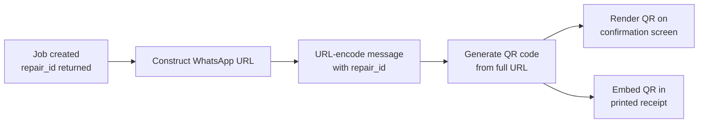

| Property    | Value                                         |
| ----------- | --------------------------------------------- |
| Library     | e.g. `qrcode.js`, `react-qr-code`             |
| Size        | 180×180px on screen, 25mm×25mm on receipt     |
| Error level | `M` (15% recovery — sufficient for print)     |
| Colour      | Black on white (monochrome, works on thermal) |
| Margin      | 4 quiet-zone modules minimum                  |

### Verification — TBD

The predefined message contains the `repair_id`. When the customer sends it via WhatsApp,
the shop's WhatsApp Business / chatbot receives the message and can:

- Match the `repair_id` to the job record
- Optionally verify the sender's phone number against the customer profile
- Reply with the current job status automatically

> **Note:** Full verification logic (phone number matching, chatbot integration,
> fallback handling) is out of scope for this spec and to be defined separately.

---

## Receipt Formats

Three receipt formats are supported. All are generated from the same underlying data.
The print action on the Job Confirmation screen prompts staff to select a format, or
the outlet's default format is used if configured.

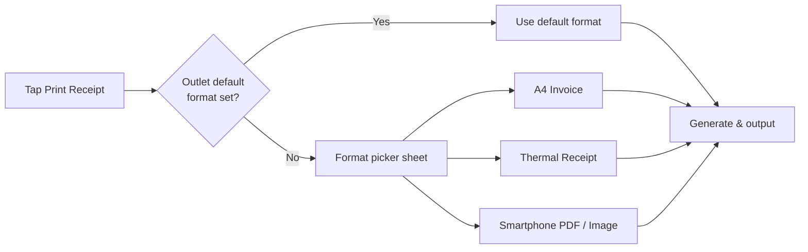

---

### Format 1 — A4 Invoice

Full-page professional invoice. Suitable for filing, warranty claims, or business customers.
Triggered via browser print dialog (`window.print()`) with a dedicated print stylesheet.

```
┌──────────────────────────────────────────────────┐
│                                                   │  ← A4 (210mm × 297mm)
│  [LOGO]              RepairFlow                  │
│  ─────────────────────────────────────────────── │
│  Outlet Name         Tel: +60X-XXX XXXX          │
│  123 Jalan Example   outlet@repairflow.com        │
│  Kuala Lumpur                                     │
│                                                   │
│  ─────────────────────────────────────────────── │
│  REPAIR INVOICE                                   │
│                                                   │
│  Job ID     #RJ-20251024-0042                     │
│  Date       Oct 24, 2025                          │
│  Est. Pickup Oct 27, 2025                         │
│                                                   │
│  Customer   Ali Evans                             │
│             +601X-XXX XXXX                        │
│  Technician Hafiz Zain                            │
│                                                   │
│  Device     iPhone 16 Pro Max (Smartphone)        │
│                                                   │
│  Reported Issues                                  │
│  · Display/Screen                                 │
│  · Battery                                        │
│                                                   │
│  ─────────────────────────────────────────────── │
│  Parts & Labour                                   │
│                                                   │
│  iPhone 16 Pro Screen      1×       RM 320.00    │
│  iPhone 16 Battery         1×        RM  85.00   │
│  Labour Fee                           RM  80.00   │
│  ─────────────────────────────────────────────── │
│  Subtotal                             RM 485.00   │
│  Tax (6% SST)                          RM  29.10  │
│  ─────────────────────────────────────────────── │
│  GRAND TOTAL                          RM 514.10   │
│                                                   │
│  ─────────────────────────────────────────────── │
│  Track your repair progress via WhatsApp:         │
│                                                   │
│  ┌──────────┐  Scan this QR code or send          │
│  │          │  "Hi, I want to get repair           │
│  │ QR CODE  │  progress for job                   │
│  │  25×25mm │  #RJ-20251024-0042"                 │
│  └──────────┘  to +60X-XXX XXXX on WhatsApp       │
│                                                   │
│  ─────────────────────────────────────────────── │
│  Thank you for choosing RepairFlow.               │
│  For enquiries: outlet@repairflow.com             │
└──────────────────────────────────────────────────┘
```

| Property | Value                                           |
| -------- | ----------------------------------------------- |
| Size     | A4 — 210mm × 297mm                              |
| Margins  | 20mm all sides                                  |
| Font     | System serif or sans-serif, min 10pt body text  |
| Trigger  | `window.print()` with `@media print` stylesheet |
| QR code  | Embedded, 25mm × 25mm, bottom of invoice        |
| Colour   | Black and white (no colour ink dependency)      |

---

### Format 2 — Thermal Receipt

Narrow-width receipt for 80mm thermal POS printers. Monochrome only. No images except
the QR code. Condensed layout — everything on one continuous roll.

```
─────────────────────────
      [LOGO / NAME]
      RepairFlow POS
  Outlet Name · KL Branch
  Tel: +60X-XXX XXXX
─────────────────────────
  REPAIR RECEIPT
─────────────────────────
  Job ID : #RJ-20251024-0042
  Date   : Oct 24, 2025
  Pickup : Oct 27, 2025
─────────────────────────
  Customer : Ali Evans
  Phone    : +601X-XXX XXXX
  Tech     : Hafiz Zain
─────────────────────────
  Device   : iPhone 16 Pro Max
  Issues   : Display, Battery
─────────────────────────
  PARTS & LABOUR
  iPhone 16 Screen
    1 × RM320.00    RM 320.00
  iPhone 16 Battery
    1 × RM 85.00     RM  85.00
  Labour Fee         RM  80.00
─────────────────────────
  Subtotal           RM 485.00
  SST (6%)            RM  29.10
─────────────────────────
  TOTAL              RM 514.10
─────────────────────────

  Track repair on WhatsApp:

  ┌──────────────────┐
  │                  │
  │    QR CODE       │
  │    (40mm×40mm)   │
  │                  │
  └──────────────────┘

  Or send this message to
  +60X-XXX XXXX on WhatsApp:
  "...progress for job
   #RJ-20251024-0042"

─────────────────────────
  Thank you!
─────────────────────────
```

| Property    | Value                                             |
| ----------- | ------------------------------------------------- |
| Paper width | 80mm (576px at 203dpi) — also supports 58mm roll  |
| Font        | Monospace, 10–12pt                                |
| Line width  | ~32–42 chars depending on font size               |
| Images      | QR code only; no logo image (text fallback)       |
| Trigger     | Dedicated thermal print stylesheet or ESC/POS lib |
| QR code     | 40mm × 40mm centred, near the bottom              |
| Colour      | Black on white only                               |

> For thermal printing, consider using a library such as `escpos` or connecting via
> WebUSB / WebBluetooth if printing directly from the browser on tablet. Server-side
> ESC/POS generation is the more reliable approach.

---

### Format 3 — Smartphone PDF / Image

A mobile-optimised single-page layout that the customer can save, share, or screenshot.
Rendered as a shareable PDF or long-image. Triggered from the smartphone confirmation
screen via the Share / Download action.

```
┌────────────────────────┐
│  [LOGO]  RepairFlow    │  ← ~390px wide
│  ────────────────────  │
│  REPAIR RECEIPT        │
│                        │
│  #RJ-20251024-0042     │
│  Oct 24, 2025          │
│  ────────────────────  │
│  Ali Evans             │
│  +601X-XXX XXXX        │
│  ────────────────────  │
│  iPhone 16 Pro Max     │
│  Display · Battery     │
│  ────────────────────  │
│  Screen      RM 320    │
│  Battery      RM  85   │
│  Labour       RM  80   │
│  ─────────────────     │
│  Subtotal    RM 485    │
│  SST (6%)     RM  29   │
│  ─────────────────     │
│  TOTAL       RM 514    │
│  ────────────────────  │
│                        │
│  ┌──────────────────┐  │
│  │                  │  │
│  │    QR CODE       │  │
│  │                  │  │
│  └──────────────────┘  │
│  Scan to track via     │
│  WhatsApp              │
│  ────────────────────  │
│  RepairFlow  ·  KL     │
└────────────────────────┘
```

| Property | Value                                                 |
| -------- | ----------------------------------------------------- |
| Width    | 390px (renders well as screenshot or PDF)             |
| Format   | PDF (via `window.print()`) or PNG (via `html2canvas`) |
| Trigger  | Share sheet on mobile → Save / WhatsApp / Email       |
| QR code  | Centred, ~120px × 120px                               |
| Colour   | Light background, dark text; one accent colour okay   |

---

### Receipt Data Model

All three formats share the same data source:

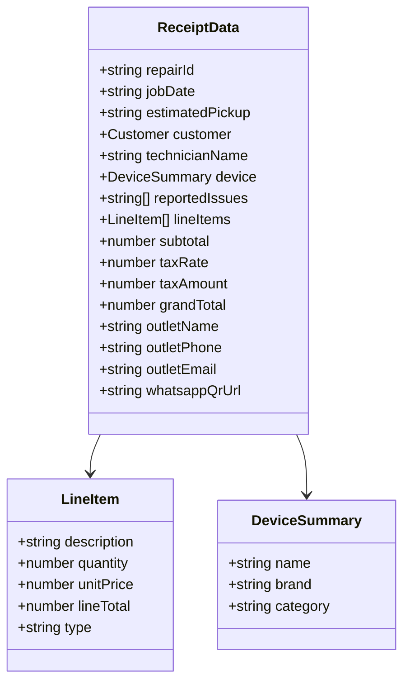

---

## Wizard State Management

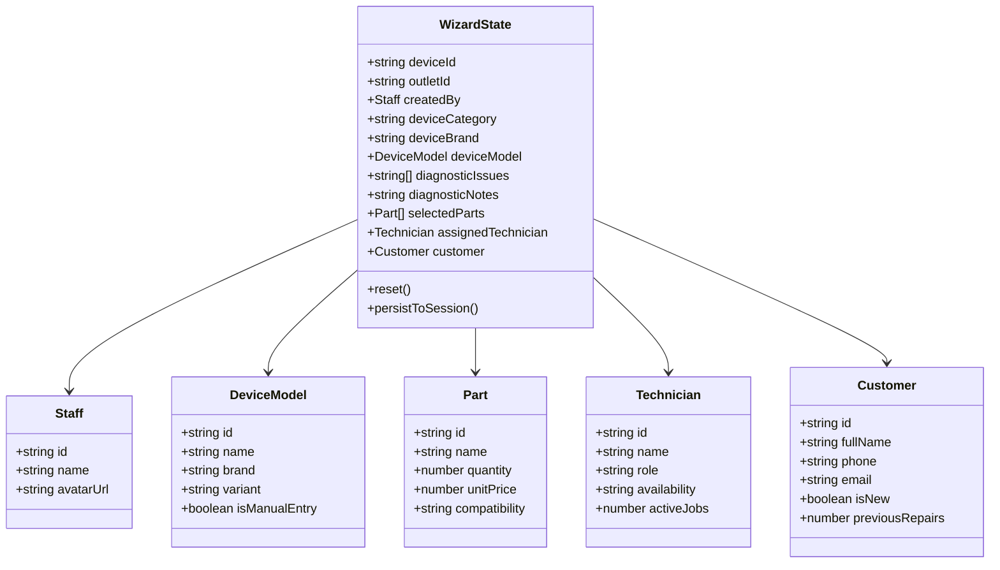

> Persist wizard state to `sessionStorage` on every step change so that an accidental
> page refresh on the kiosk or tablet does not lose a partially completed intake.

---

## Error & Empty States

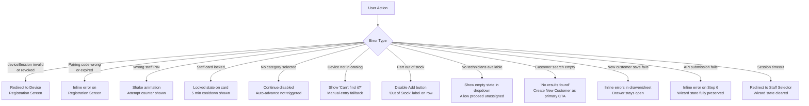

---

## Discard Confirmation Dialog

Triggered by tapping **"Cancel Intake"** on any step, or any unhandled navigation-away.

```
  ┌──────────────────────────────────────────┐
  │   Discard Repair Intake?                 │
  │                                          │
  │   All entered information will be lost   │
  │   and cannot be recovered.               │
  │                                          │
  │   [ Keep Editing ]        [ Discard ]    │
  └──────────────────────────────────────────┘
```

| Action       | Behaviour                                            |
| ------------ | ---------------------------------------------------- |
| Keep Editing | Closes dialog; returns to current step, state intact |
| Discard      | Clears all wizard state; returns to Step 1           |

---

## Touch & Accessibility Guidelines

### Tap Targets

| Element              | Minimum size          |
| -------------------- | --------------------- |
| Category cards       | 80px height           |
| Brand tiles          | 56px height           |
| Issue shortcut cards | 72px height           |
| Parts Add [+] button | 48×48px               |
| Qty stepper [−] [+]  | 44×44px               |
| Customer cards       | 64px height           |
| Continue / Back      | 52px height, full row |
| Technician list rows | 64px height           |

### Keyboard Behaviour (Soft Keyboard on Mobile)

- When a search bar or text field is focused, the layout scrolls to keep the field
  visible above the soft keyboard
- Sticky action bar remains anchored above the keyboard, not behind it
- Summary peek bar on smartphone is hidden while keyboard is open to maximise space

### Other Touch Considerations

- No hover-dependent interactions anywhere in the flow
- All interactive elements have visible pressed/active states
- Swipe-left on a selected parts row reveals a delete affordance on tablet
- Drag-to-reorder is not required for parts in this version

---

_End of POS Frontend Specification_
