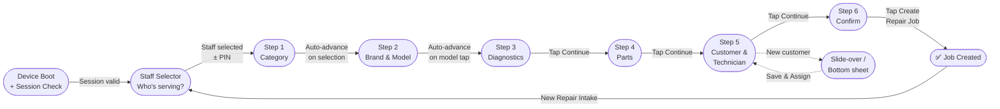

# POS Portal — Frontend Specification

> **Last updated:** v1.0 final — all design decisions incorporated
> **Primary device:** Tablet / iPad
> **Secondary device:** Smartphone (on-the-go POS)
> **Original archive:** [`pos-frontend-spec-ARCHIVE.md`](pos-frontend-spec-ARCHIVE.md)

---

## Overview

The New Repair Intake is the primary transaction flow of the POS portal. It is a **6-step linear wizard** that guides front desk staff through creating a complete repair job — from device identification to customer and technician assignment and final invoice confirmation.

The POS portal is a **fully locked, single-purpose interface**. There is no navigation, no sidebar, and no way to access other areas of the system. Every interaction is scoped entirely to the repair intake flow.

The interface is **designed first for tablet and iPad**, with full support for smartphone as a secondary on-the-go POS device. Layouts, tap targets, and interaction patterns are optimised for touch throughout.

---

## Master Wizard Flow

---

## Feature Spec Files

| # | File | Feature | Scope |
|---|---|---|---|
| 1 | [`pos-01-device-registration.md`](pos-01-device-registration.md) | Device Registration & Authentication | Pairing code flow, device identity, session storage, boot check |
| 2 | [`pos-02-staff-selector.md`](pos-02-staff-selector.md) | Staff Selector & Identity | Staff selection UI, optional PIN, top-bar identity, ticket attribution |
| 3 | [`pos-03-app-shell.md`](pos-03-app-shell.md) | Application Shell & Layout | Top bar, avatar popover, language toggle, responsive breakpoints |
| 4 | [`pos-04-navigation.md`](pos-04-navigation.md) | Navigation, Breadcrumb & Summary | Dynamic breadcrumb, cascade rules, auto-advance, sticky action bar, summary panel |
| 5 | [`pos-05-step1-category.md`](pos-05-step1-category.md) | Step 1 — Device Category | Category grid, auto-advance, inspection fee banner |
| 6 | [`pos-06-step2-brand-model.md`](pos-06-step2-brand-model.md) | Step 2 — Brand & Model | Brand selector, model grid, search, manual entry |
| 7 | [`pos-07-step3-diagnostics.md`](pos-07-step3-diagnostics.md) | Step 3 — Device Diagnostics | Issue multi-select, specific notes, device context badge |
| 8 | [`pos-08-step4-parts.md`](pos-08-step4-parts.md) | Step 4 — Parts Selection | Parts search, inventory list, qty steppers, live subtotal |
| 9 | [`pos-09-step5-customer-tech.md`](pos-09-step5-customer-tech.md) | Step 5 — Customer & Technician | Customer search, collapse pattern, technician assignment, availability |
| 10 | [`pos-10-step6-confirm-create.md`](pos-10-step6-confirm-create.md) | Step 6 — Confirm & Create | Final invoice view, Create Repair Job CTA, duplicate prevention |
| 11 | [`pos-11-new-customer.md`](pos-11-new-customer.md) | New Customer Flow | Slide-over drawer (tablet) / bottom sheet (mobile), form validation |
| 12 | [`pos-12-job-confirmation.md`](pos-12-job-confirmation.md) | Job Confirmation & WhatsApp QR | Dead-end confirmation screen, QR code generation, deep-link format |
| 13 | [`pos-13-receipts.md`](pos-13-receipts.md) | Receipt Formats | A4 invoice, thermal receipt, smartphone PDF/image, shared data model |
| 14 | [`pos-14-state-errors-accessibility.md`](pos-14-state-errors-accessibility.md) | State, Errors & Accessibility | Wizard state model, error/empty states, discard dialog, touch guidelines |

---

## Cross-Cutting Concerns

These topics span multiple steps and are defined centrally:

- **Authentication & Session** — [`pos-01-device-registration.md`](pos-01-device-registration.md)
- **Identity & Attribution** — [`pos-02-staff-selector.md`](pos-02-staff-selector.md)
- **Layout & Responsive Design** — [`pos-03-app-shell.md`](pos-03-app-shell.md)
- **Navigation Patterns** — [`pos-04-navigation.md`](pos-04-navigation.md)
- **Data Models** — [`pos-14-state-errors-accessibility.md`](pos-14-state-errors-accessibility.md) (WizardState, ReceiptData)
- **Accessibility** — [`pos-14-state-errors-accessibility.md`](pos-14-state-errors-accessibility.md)
